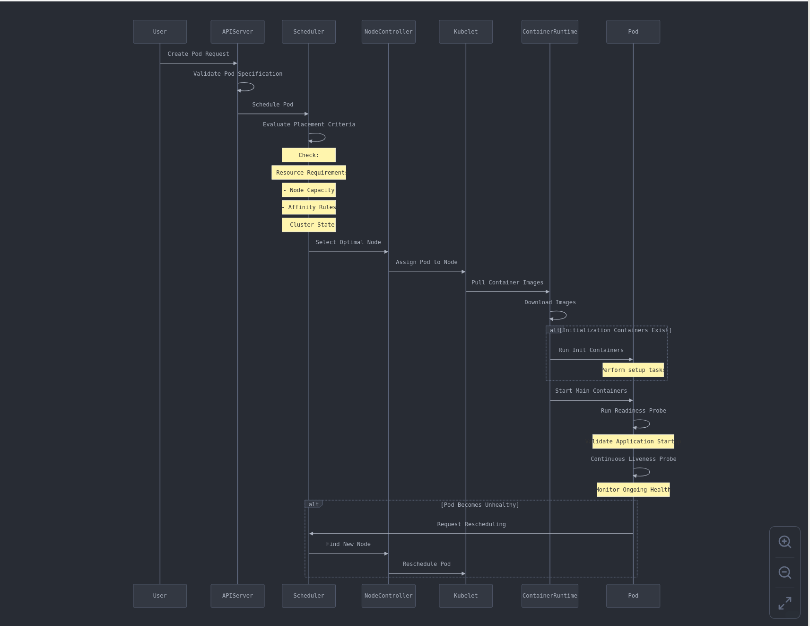
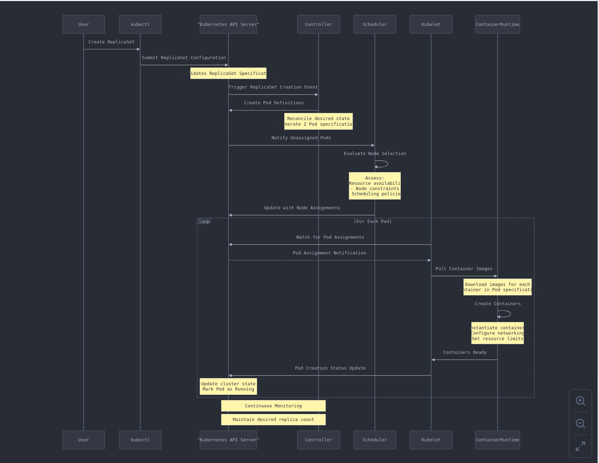

## Introduction: Why Kubernetes Matters for Scala Developers
Imagine that you've built an interesting Scala application, and you are ready to deploy it for your users to consume
your services. As a good developer you foresee numerous real challenges to address for your application to efficiently
serve the public. How will the application scale up and down in response to the traffic, avoid service downtime, maximize
cost-efficiency? The most efficient solution for your worries is Kubernetes.

If you as a Scala developer you are struggling with your infrastructure, auto-scaling and some deployment automation
headaches, this first part guide will guide you through building a powerful application ecosystem by introducing you to
the core concepts of a Kubernetes cluster. By the end of this first part you'll be able to understand the architecture
of a Kubernetes cluster, the main components of Kubernetes, how to scale up or down your application, how to apply
zero-downtime deployments and more. The second part will guide you through continuous integration and deployment, monitoring,
and help you build a production-ready Kubernetes cluster.

## Kubernetes: Your Application's New Best Friend
Kubernetes is not just another helper tool for deploying applications. It's a complete infrastructural ecosystem positioning
itself as the most modern solution for deploying resilient and elastics applications. It is a hyper-intelligent and extensible
deployment orchestrator that manages all aspects of your application's lifecycle.

### Why Should Scala Developers Care?
The reasons for caring about Kubernetes are what it promises. The most important promises of Kubernetes are:
- **Effortless Scaling**: Grow or shrink your application automatically in response to the incoming workload
- **Self-Healing Magic**: Automatic response to failing containers during their lifecycle
- **Consistent Deployments**: Run the same application anywhere either on local machine, cloud or hybrid environment
- **Resource Optimization**: Squeeze maximum performance from your infrastructure

## Development environment
For the development environment multiple solutions exists, but we'll use Minikube as our local kubernetes. It is a
solution that make learning and development easier for kubernetes. For it to work, you mainly need Docker installed.
After this all you need is to follow the instructions on the page [Install k8s for local development](https://minikube.sigs.k8s.io/docs/start).
Kubernetes specifications artifact are written in yaml format and all the Kubernetes components details are found on the
link [Kubernetes components](https://kubernetes.io/docs/concepts/). For the Kubernetes specifications in this article we'll use the
following two commands to deploy and drop Kubernetes components on our cluster.
* To make a deployment run `kubectl apply -f workload-api.yaml`.
* To drop a deployment run `kubectl delete -f workload-api.yaml`.

In these commands, `workload-api.yaml` is a Kubernetes yaml configuration file(place in a folder of your computer and
open a terminal at the root of that folder). The name of the file doesn't matter only its content matter. `kubectl` is
the kubernetes client we use to send our request to the API-Server with is the front end of any kubernetes cluster.
It is the element to which any new change on the cluster is sent to, and it collaborates with other component to achieve
the expected result if possible. To have a view of the Kubernetes internals we can run in a separate terminal the
commands `minikube addons enable dashboard` and `kubectl addons enable metrics-server` that will install the needed tools
to visualize the activity on the cluster. We can then run the command `minikube dashboard` which will open a web page in
our default browser to see all the objects running on the cluster.

## The Kubernetes Landscape: A High-Level View
Kubernetes came to life from a Google engineering team drawing on their long experience in managing large-scale containerized
systems. The project was later transferred to the Cloud Native Computing Foundation, establishing it as a community-driven
open-source initiative.
Kubernetes offers as core functionalities:
* Seamless deployment with zero-downtime updates and dynamic scaling
* Complete platform portability across cloud providers and on-premises environments
* Extensible architecture that adapts to specific organizational needs
* Intelligent workload placement and state management
* Built-in self-healing with emerging self-adaptation capabilities
* Comprehensive operational features including storage management, secrets handling, health checks, load balancing, resource
  monitoring, service discovery, and logging

The Kubernetes architecture is made up of two main parts:

### Control Plane (Master nodes)
The control plane administers and makes cluster wide decisions such as scheduling, detection and response to cluster events like
starting a new pod when there is a difference between the requirements and the actual state of the cluster. It is also responsible
for monitoring the cluster and making sure the desired state of the cluster is maintained. The main components of the control plane
are:
* **Kube-apiserver**: responsible for exposing the Kubernetes API, it is the front end of the Kubernetes control plane through
    which we can talk to Kubernetes.
* **etcd**: Highly-available consistent key value store for all Kubernetes cluster data.
* **Kube-scheduler**: process constantly watching for newly created Pods that are not assigned to a node, select
    a node for them to run base on resource availability distribution cluster-wide.
* **Kube-controller-manager**: responsible for executing Controllers processes. In Kubernetes Controllers are control loops
    that watch the state of your cluster through the API-Server, then make or request changes where needed in other to move
    the actual state of your cluster toward the desired state. A given controller is responsible for tracking one type of
    Kubernetes resource type.
        An example of Controller is the built-in Job Controller. A Job is a Kubernetes resource that runs one or multiple
    Pods to execute a task and then stops. When a new task is scheduled the Job Controller will make sure that some nodes
    on the cluster are running the desired number of Pods to get the work done. It does this by telling the API server to instruct
    the creation of the Pods(containers encapsulation that is the smallest unit on kubernetes) that will execute the task.

### Worker Nodes
The main goal of the worker nodes is to host the Pods that are run the application workload. All your application
container instances will be run on the worker nodes. The control plane schedule and manages all activities carry out on the worker
nodes. The main components of the worker nodes are:
* **Kubelet**: an agent running on each node in the cluster and making sure that containers are running in the Pods as per the
desired state, and are in a good state.
* **Kube-proxy**: a network proxy running on each node in the cluster, responsible for maintaining network rules on nodes. These
network rules allow the communication to the pods from network sessions inside and outside the cluster.
* **Container runtime**: a software package that knows how to leverage specific features on a supported operating system
to run the containers. Its responsibility is to manage the execution of containers withing the Kubernetes environment.

## Kubernetes Components

### Pods: Your Application's Smallest Unit
Think of a Pod like a dedicated apartment for your containers. It's a compact living space where one or more containers
live together, sharing resources. Imagine a Pod as a smart, self-contained shipping container for your application.
It's not just a simple container, but a sophisticated ecosystem with multiple layers of intelligence behind its creation
and deployment. It abstracts the containers and provides a unique interface for different containers(Docker, Virtual machines,...)
solutions that can be used.

#### Pod Lifecycle and Scheduling: Behind the Scenes
In kubernetes, Pods are the smallest unit of workload execution that you can create and manage. It is a group of one or
more containers, with shared storage and network resources and specification for how to run the container.

When you create a Pod, Kubernetes initiates multiple actions:

* **Scheduling Decision**: The scheduler receives pod creation request and base on the current state of the cluster,
    the available computing resources, the cluster topology requirements, Hardware constraints and other factors, selects
    the node on which the pod should run.
** **Pod Placement Workflow**: After the Scheduler has identified the optimal node on which the pod will run,
    the Control plane communicates with the selected node's Kubelet and give all the specification for running the pod.
    The Kubelet then pulls necessary container images and the container runtime create and starts containers. At this step
    the Pod is said to be in "Running" state after a successful initialization.
* **Container Startup Sequence**: If the init containers have been provided, they will run first and only after that the
    pod main container will start. They are containers that are intended to be started, run initializing works and stops
    before the actual container that should execute the application to deploy is started. If liveness and readiness probes
    are provided, pod will become available only after the startup probe is successful and will be considered alive as long
    as the liveness probe will be successful. After they are started, the containers are made available for service
    discovery and networking.

* **Notification**: After the pods are created, Kubelet will reports Pod creation status to the API Server, and confirms
    successful container deployment. After this the cluster state in the `ectd` key-value store database will be updated.

##### Visualization of the Process
Here's a sequential diagram to illustrate the workflow:


##### Example
```yaml
apiVersion: v1
kind: Pod
metadata:
 name: workload-api
 labels:
    type: api
    language: scala
    framework: play-framework
    service: workload
spec:
 containers:
   - name: workload-api
     image: aidocking/pfpw:20.20.31
     ports:
       - containerPort: 9000
```

Explanations:
* **API Version and Kind**: The first two lines specify the Kubernetes Pods API version, which is crucial for Kubernetes
to understand the intended action and correctly process the Pod creation request.
* **Metadata Section**: This part provides descriptive information about the Pod, including its name and labels. While
labels don't affect the Pod's behavior currently, they become important when working with Kubernetes controllers.
* **Specification Section(`spec`)**: The spec defines the Pod behavior.
* **Container Definition(`spec.containers`)**: The container details include its name, the Docker image to use, and the
specific command to run when the container starts up. It is advised to specify only one container in a pod, but Kubernetes
allows multiple containers to be defined in a single Pod configuration. In this case, it's a Play framework app container
with the port 9000 exposed. It should be noted that pod are not intended to be created individually in real-life scenarios.
They will be created through deployments.

Deploy: `kubectl apply -f workload-api.yaml`

Response:
```text
kubectl apply -f workload-api.yaml
pod/workload-api created
```
View: `kubectl get pods` or `kubectl get -f workload-api.yaml`

Response:
```text
kubectl get pods
NAME           READY   STATUS    RESTARTS   AGE
workload-api   1/1     Running   0          3m53s
```
Drop: `kubectl delete -f workload-api.yaml` or `kubectl delete pod workload-api`

Response:
```text
kubectl delete -f workload-api.yaml
pod "workload-api" deleted
```

### ReplicaSet
ReplicaSet is a Kubernetes component of which The primary function is to ensure that a specified number of pods replicas
is almost always running.A ReplicaSet is used by Kubernetes to maintain the availability of a specified number of identical Pods.
In practice, they are not managed individually by the user specification, but they are transitively created by Kubernetes
when required, to control the number of Pod replicas. The number of replicas here is proportional to the workload that Pods are supposed
to manage, and it fully depends on your use case. The more the workload, the more the replicas of the Pods.

#### ReplicaSet Lifecycle: A Step-by-Step Symphony
When the user or the system triggers a ReplicaSet creation, Kubernetes client (kubectl) sends a ReplicaSet creation request
to the API server and the payload includes detailed specifications.
When the Kubernetes controller detects new ReplicaSet object in the cluster, it initiates a reconciliation process
by Comparing the desired state(specified replicas) with current cluster state. This will be followed by the pod creation
mechanism as described above.

#### Visualization of the Process



#### Example
```yaml
apiVersion: apps/v1
kind: ReplicaSet
metadata:
  name: workload-api-rep
spec:
  replicas: 2
  selector:
    matchLabels:
      type: api
      language: Scala
      framework: play-framework
  template:
    metadata:
      labels:
        type: api
        language: Scala
        framework: play-framework
    spec:
      containers:
        - name: workload-api
          image: aidocking/pfpw:20.20.31
          resources:
            limits:
              memory: "3Gi"
              cpu: "2"
```

Explanations:
* **API(apiVersion) and Resource Definition(Kind)**: specifies the Kubernetes API version for a ReplicaSet, defining its
basic metadata with a name identifier.

* **Replica Configuration(spec)**: sets the desired number of concurrent Pods, defaulting to one if not explicitly specified.
This ensures consistent application deployment across the cluster.

* **Pod Selection Mechanism(template.metadata.labels)**: Use a selector to identify and manage Pods, regardless of their
origin. The ReplicaSet dynamically maintains the specified number of Pods by creating, monitoring, or terminating instances as needed.

* **Label Matching Strategy(spec:.elector.matchLabels)**: Define precise label criteria to match and manage Pods, ensuring that the ReplicaSet
targets the correct set of containers across the Kubernetes environment. In this case pod having the labels
type: api, language: Scala and framework: play-framework will be managed by the ReplicaSet

* **Template Specification(spec.template)**: Provide a Pod template that serves as a blueprint for creating new Pods when necessary,
with mandatory container definitions that guide the ReplicaSet's deployment logic.

* **Container Definition(spec.template.spec.containers)**: In the template specifications, containers entry specifies the containers
to be deployed within the Pods, detailing their configuration and ensuring consistent application setup across replicas.
we specify a name for the pod, image and limits(maximum resource to be used by the pod) of the resources(cpu or memory) consumed
by the containers in pods so that resource usage can be controlled.

Deploy: `kubectl apply -f workload-api.yaml`

Response:
```
kubectl apply -f workload-api.yaml
replicaset.apps/workload-api-rep created
```

View: `kubectl get replicasets` or `kubectl get -f workload-api.yaml`

Response:
```text
kubectl get replicasets
NAME               DESIRED   CURRENT   READY   AGE
workload-api-rep   2         2         0       2m33s
```
Drop: `kubectl delete -f workload-api.yaml` or `kubectl delete replicaset workload-api-rep`

Response:
```text
kubectl delete -f workload-api.yaml
replicaset.apps "workload-api-rep" deleted
```

### Services

Services route the traffic to the right containers and provide a stable network endpoint. When multiple instances(replicas)
of a Pod are running they act like a load balancer, distributing traffic to different pods.
In Kubernetes, Services are the master network conductors, transforming the ephemeral and dynamic nature of Pods into
stable, predictable communication endpoints. They provide stable addresses for communication that doesn't depend on the lifecycle
of the pod. On a contrary, a pod is killed and new one are created, they are new network address and the previous ones ar lost.
Imagine Pods as temporary workers constantly moving between offices. Services are like permanent phone numbers that always
route to the right person, regardless of their current location. Without Services, networking in Kubernetes would be chaotic
and unreliable. They receive the request(on their state address) targeting Pods(having unstable network address) and route
traffic to them. With this when a pod has failed and a new one is started, it can still be reached through the service.

#### Service Types

1. **ClusterIP Service**: This is the backbone of cluster Internal Communication, and it is the default service type.
    It provides the stable(available as long as the service is alive) IP address inside the cluster and is accessible internally.
    It is best suited for inter service communication, and internal networking.

    ```yaml
    apiVersion: v1
    kind: Service
    metadata:
      name: workload-service
    spec:
      type: ClusterIP
      selector:
        type: api
        language: scala
        framework: play-framework
        service: workload
      ports:
       - port: 9000
         targetPort: 9000
    ```

    Deploy: `kubectl apply -f workload-api.yaml`

    Response:
    ```text
    kubectl apply -f workload-api.yaml
    service/workload-service created
    ```
    View: `kubectl get services` or `kubectl get -f workload-api.yaml`

    Response:
    ```text
    kubectl get services
    NAME               TYPE        CLUSTER-IP     EXTERNAL-IP   PORT(S)    AGE
    kubernetes         ClusterIP   100.64.0.1     <none>        443/TCP    15h
    workload-service   ClusterIP   100.66.5.235   <none>        9000/TCP   45s
    ```
    Drop: `kubectl delete -f workload-api.yaml` or `kubectl delete service workload-service`

    Response:
    ```text
    kubectl delete -f workload-api.yaml
    service "workload-service" deleted
    ```

2. **NodePort Service**: This service type offer and external Access Gateway by exposing a service on a static port(30000-32767)
    across all nodes. With this type of service you can make your application accessible outside the cluster. This type is best
    suited for development and testing environments and we will provide a full example for this specific service type.

   ```yaml
   apiVersion: v1
   kind: Service
   metadata:
     name: workload-service
   spec:
     type: NodePort
     selector:
       type: api
       language: scala
       framework: play-framework
     ports:
       - port: 9000
         targetPort: 9000
         nodePort: 30123
   ```

    Deploy: `kubectl apply -f workload-api.yaml`

    Response:
    ```text
    kubectl apply -f workload-api.yaml
    service/workload-service created
    ```
    View: `kubectl get services` or `kubectl get -f workload-api.yaml`

    Response:
    ```text
    kubectl get services
    NAME               TYPE        CLUSTER-IP     EXTERNAL-IP   PORT(S)          AGE
    kubernetes         ClusterIP   100.64.0.1     <none>        443/TCP          15h
    workload-service   NodePort    100.67.236.7   <none>        9000:30123/TCP   44s
    ```

    Drop: `kubectl delete -f workload-api.yaml` or `kubectl delete service workload-service`

    Response:
    ```text
    kubectl delete -f workload-api.yaml
    service "workload-service" deleted
    ```

3. **LoadBalancer Service**: This type exposes the service externally using  an external load balancer
   generally provided by your cloud provider. It is best suited for production ready web applications, public-facing services,
   and integration with external systems.

   ```yaml
   apiVersion: v1
   kind: Service
   metadata:
     name: workload-service
   spec:
     type: LoadBalancer
     selector:
        type: api
        language: scala
        framework: play-framework
        service: workload
     ports:
       - port: 9000
         targetPort: 9000
   ```

    Deploy: `kubectl apply -f workload-api.yaml`
    ```text
    kubectl apply -f workload-api.yaml
    service/workload-service created
    ```
    View: `kubectl get services` or `kubectl get -f workload-api.yaml`

    Response:
    ```text
    kubectl get services
    NAME               TYPE           CLUSTER-IP     EXTERNAL-IP   PORT(S)          AGE
    kubernetes         ClusterIP      10.96.0.1      <none>        443/TCP          22d
    workload-service   LoadBalancer   10.108.48.81   <pending>     9000:31248/TCP   5s
    ```
    Drop: `kubectl delete -f workload-api.yaml` or `kubectl delete service workload-service`

    Response:
    ```text
    kubectl delete -f workload-api.yaml
    service "workload-service" deleted
    ```

4. **ExternalName Service**: maps the service to an external DNS name, like a database hosted outside
    the cluster. It then serves as an abstraction layer around cluster external addresses. The key advantages of using
    services over direct pod communication is that  services survive to Pod restarts, and decouple service discovery from
    pod lifecycle. When a pod restarts, the previous network address is lost and a new one is assigned to the new pod.
    It also serves as a load balancer distributing traffic across multiple pods.

   ```yaml
   apiVersion: v1
   kind: Service
   metadata:
     name: workload-external-database
   spec:
     type: ExternalName
     selector:
       type: api
       language: scala
       framework: play-framework
       service: workload
     externalName: workload-database.example.com
   ```

    Deploy: `kubectl apply -f workload-api.yaml`

    Response:
    ```text
    kubectl apply -f workload-api.yaml
    service/workload-external-database created
    ```
    View: `kubectl get services` or `kubectl get -f workload-api.yaml`

    Response:
    ```text
    kubectl get -f workload-api.yaml
    NAME                         TYPE           CLUSTER-IP   EXTERNAL-IP                     PORT(S)   AGE
    workload-external-database   ExternalName   <none>       workload-database.example.com   <none>    77s
    ```

    Drop: `kubectl delete -f workload-api.yaml` or `kubectl delete service workload-external-database`

    Response:
    ```text
    kubectl delete service workload-external-database
    service "workload-external-database" deleted
    ```

#### Visualization: Service Communication Flow


#### Example
In this example, a Scala play framework application is being served through a NodePort service type.
```yaml
apiVersion: v1
kind: Pod
metadata:
 name: workload-api
 labels:
   type: api
   language: scala
   framework: play-framework
   service: workload
spec:
 containers:
   - name: workload-api
     image: aidocking/pfpw:20.20.31
     ports:
       - containerPort: 9000

---
apiVersion: v1
kind: Service
metadata:
 name: workload-service
spec:
 type: NodePort
 selector:
   type: api
   language: scala
   framework: play-framework
 ports:
   - port: 9000
     targetPort: 9000
     nodePort: 30123
```

Explanations:
* **API(apiVersion) and Resource Definition(Kind)**: Specify the Kubernetes API version for a ReplicaSet, defining its basic metadata with a name identifier.

* **Pod Selection Mechanism(spec.selector)**: Use a selector to identify and manage Pods, regardless of their origin. All the pod that share
    these labels will be served by this service.

* **Label Matching Strategy(metadata.labels)**: Define precise label criteria on pod that will be matched by the service.

Deploy: `kubectl apply -f workload-api.yaml`

Response:
```text
pod/workload-api created
service/workload-service created
```

View: `kubectl get -f workload-api.yaml`

Response:
```text
kubectl get -f workload-api.yaml
NAME               READY   STATUS    RESTARTS   AGE
pod/workload-api   1/1     Running   0          29s

NAME                       TYPE       CLUSTER-IP       EXTERNAL-IP   PORT(S)          AGE
service/workload-service   NodePort   10.107.158.121   <none>        9000:30123/TCP   29s
```

Drop: `kubectl delete -f workload-api.yaml` or `kubectl delete service workload-service`

Response:
```text
kubectl delete -f workload-api.yaml
pod "workload-api" deleted
service "workload-service" deleted
```

### Ingress

Kubernetes requires an external mechanism to manage incoming web traffic properly. This Ingress system needs to route requests
from standard web ports to the appropriate internal services based on URL paths and domains, while also handling SSL encryption.
Unlike other controllers built into Kubernetes core, Ingress controllers must be installed separately - Kubernetes only provides
the API framework through its Ingress resource definition. Fortunately, the community has developed numerous Ingress controller
implementations to fulfill these requirements, though selection depends on specific project needs and infrastructure constraints.
The first thing to do is to enable ingress controller in our cluster: `kubectl addons enable ingress`

#### Example
```yaml
apiVersion: v1
kind: Pod
metadata:
  name: workload-api
  labels:
    type: api
    language: scala
    framework: play-framework
    service: workload
spec:
  containers:
    - name: workload-api
      image: aidocking/pfpw:20.20.31
      ports:
        - containerPort: 9000

---
apiVersion: v1
kind: Service
metadata:
  name: workload-service
spec:
  type: ClusterIP
  selector:
    type: api
    language: scala
    framework: play-framework
  ports:
    - port: 9000
      targetPort: 9000
---
apiVersion: networking.k8s.io/v1
kind: Ingress
metadata:
  name: api-workload-ingress
  annotations:
    'spec.ingressClassName': "nginx"
    ingress.kubernetes.io/ssl-redirect: "false"
    nginx.ingress.kubernetes.io/ssl-redirect: "false"
spec:
  rules:
    - host: k8splayworkload.com
      http:
        paths:
          - path: /
            pathType: ImplementationSpecific
            backend:
              service:
                name: workload-service
                port:
                  number: 9000
```

Explanations:
The metadata section introduces annotations as a flexible mechanism for providing controller-specific information beyond
the core Ingress specification. This design intentionally keeps the Kubernetes Ingress API minimal while enabling
controller-specific customization through annotations. `k8splayworkload.com` is the fully qualified domain name of a
network host, as defined by RFC 3986  We disable HTTPS redirection with the annotation
`nginx.ingress.kubernetes.io/ssl-redirect: false` since we lack SSL certificates for our exercises. In the specification
section, we define traffic routing rules. Our configuration routes all HTTP requests with paths beginning with `/` to the
`workload-service` service on port 8080, creating a clean pathway for external traffic to reach our specific application.
backend defines the referenced service endpoint to which the traffic will be forwarded to in this case `workload-service`.
To access the service trough the nginx ingress controller open your `/etc/hosts` in a linux machine(or corresponding file on
other os) and append this line: `node-address k8splayworkload.com` where node-id is the address of your cluster node that
can be retrieve using `minikube ip`. After this the targeted service becomes accessible from your browser at the hostname
`k8splayworkload.com`.
Deploy: `kubectl apply -f workload-api.yaml`

Response:
```text
kubectl apply -f workload-api.yaml
pod/workload-api created
service/workload-service created
ingress.networking.k8s.io/api-workload-ingress created
```

View: `kubectl get -f workload-api.yaml`

Response:
```text
kubectl get -f workload-api.yaml
NAME               READY   STATUS    RESTARTS   AGE
pod/workload-api   1/1     Running   0          30s

NAME                       TYPE        CLUSTER-IP      EXTERNAL-IP   PORT(S)    AGE
service/workload-service   ClusterIP   10.111.108.11   <none>        9000/TCP   30s

NAME                                             CLASS   HOSTS                 ADDRESS   PORTS   AGE
ingress.networking.k8s.io/api-workload-ingress   nginx   k8splayworkload.com             80      30s
```

Drop: `kubectl delete -f workload-api.yaml`
```text
kubectl delete -f workload-api.yaml
pod "workload-api" deleted
service "workload-service" deleted
ingress.networking.k8s.io "api-workload-ingress" deleted
```

### ConfigMaps and Secrets: Configuration Maestros

Separate your configuration from code! ConfigMaps handle non-sensitive configurations, while Secrets manage sensitive
data like passwords and tokens here we have converted the actual value into base64 using:
`echo -n value-of-secret | base64 --decode`. Replace in this command the `value-of-secret` with the value of
your secret. `config-one`(respectively `secret-one`) are the keys and `config-value` (respectively `secret-one`,) are
values.

```yaml
# ConfigMap for application settings
apiVersion: v1
kind: ConfigMap
metadata:
 name: workload-config
data:
 config-one: "config-value"
```
Deploy: `kubectl apply -f workload-api.yaml`

Response:
```text
kubectl apply -f workload-api.yaml
configmap/workload-config created
```

View: `kubectl get -f workload-api.yaml` or `kubectl get configmaps`

Response:

```text
kubectl get -f workload-api.yaml
NAME              DATA   AGE
workload-config   1      27s
```

Drop: `kubectl delete -f workload-api.yaml` or `kubectl delete configmap workload-config`

Response:

```text
kubectl delete -f workload-api.yaml
configmap "workload-config" deleted
```

```yaml
# Secrets for sensitive information
apiVersion: v1
kind: Secret
metadata:
 name: workload-secret
type: Opaque
data:
 secret-one: bW9uZ291c2Vy
 secret-two: bW9uZ29wYXNzd29yZA==
```
Deploy: `kubectl apply -f workload-api.yaml`

Response:
```text
kubectl apply -f workload-api.yaml
secret/workload-secret created
```

View: `kubectl get -f workload-api.yaml` or `kubectl get configmaps`

Response:
```text
kubectl get configmaps
NAME               DATA   AGE
kube-root-ca.crt   1      22d
```

Drop: `kubectl delete -f workload-api.yaml` or `kubectl delete secret workload-secret`

Response:
```text
kubectl delete secret workload-secret
secret "workload-secret" deleted
```

### Deployments: Your Rollout Strategy Manager

Deployments are the smart project managers of Kubernetes. They handle updates, rollbacks, and ensure smooth transitions
between application versions. Kubernetes Deployments offer sophisticated orchestration capabilities that eliminate
downtime during application updates. This mechanism handles the complex coordination required when transitioning between
software versions by carefully managing Pod lifecycles and traffic routing. When initiated, a Deployment creates a new
ReplicaSet that gradually scales up with updated application instances while simultaneously scaling down the previous
version's ReplicaSet. This controlled transition ensures continuous service availability as traffic seamlessly shifts
to new Pods only after they're fully operational. The process includes built-in health checks, rollback capabilities,
and configurable deployment strategies (like rolling updates with customizable surge parameters), effectively preventing
the service disruptions commonly experienced with traditional update methods. This comprehensive approach ensures
applications remain available throughout the entire update lifecycle, maintaining system reliability even during active
changes.


#### Deployment Lifecycle

1) * **Initiation** : The user submits a Deployment YAML to the API Server, which validates and stores it.
2) * **Controller Actions** :
    * The Deployment Controller in the Controller Manager creates a ReplicaSet
    * The ReplicaSet Controller then creates Pod objects to match the desired count
3) * **Scheduling Process** : The Scheduler assigns Pods to specific Nodes based on resource requirements and constraints
4) * **Pod Creation** :
    * The Kubelet on the assigned Node pulls container images
    * Container Runtime creates and starts the actual containers
    * Status updates flow back through the system
5) * **Monitoring Cycle** :
    * The Kubelet monitors container health and restarts containers if needed
    * The Controllers ensure the desired state is maintained

#### Visualization of the deployment process
This diagram illustrates how Kubernetes orchestrates deployments through multiple coordinated components, each with
specific responsibilities in the workflow.


```yaml
apiVersion: apps/v1
kind: Deployment
metadata:
  name: workload-api
  labels:
    demo: k8s-auto-scaling
spec:
  selector:
    matchLabels:
      type: api
      language: scala
      framework: play-framework
      service: workload
  minReadySeconds: 1
  progressDeadlineSeconds: 1200
  revisionHistoryLimit: 5
  strategy: # Deployment strategy
    type: RollingUpdate
    rollingUpdate:
      maxSurge: 1
      maxUnavailable: 1
  template: # Pod definition
    metadata:
      labels:
        type: api
        language: scala
        framework: play-framework
        service: workload
    spec:
      containers:
        - name: workload-api
          image: aidocking/pfpw:20.20.31
          ports:
            - containerPort: 9000
          livenessProbe:
            httpGet:
              path: /live
              port: 9000
            failureThreshold: 3
            timeoutSeconds: 2
            periodSeconds: 10
            initialDelaySeconds: 5

          startupProbe:
            httpGet:
              path: /startup
              port: 9000
            failureThreshold: 30
            periodSeconds: 15
            timeoutSeconds: 2

          readinessProbe:
            httpGet:
              path: /ready
              port: 9000
            failureThreshold: 10
            periodSeconds: 15
            timeoutSeconds: 10

---
apiVersion: v1
kind: Service
metadata:
  name: workload-service
spec:
  type: ClusterIP
  selector:
    type: api
    language: scala
    framework: play-framework
  ports:
    - port: 9000
      targetPort: 9000
---
apiVersion: networking.k8s.io/v1
kind: Ingress
metadata:
  name: api-workload-ingress
  annotations:
    'spec.ingressClassName': "nginx"
    ingress.kubernetes.io/ssl-redirect: "false"
    nginx.ingress.kubernetes.io/ssl-redirect: "false"
spec:
  rules:
    - host: k8splayworkload.com
      http:
        paths:
          - path: /
            pathType: ImplementationSpecific
            backend:
              service:
                name: workload-service
                port:
                  number: 9000
```
Deploy: `kubectl apply -f workload-api.yaml`

Response:
```text
deployment.apps/workload-api created
service/workload-service created
ingress.networking.k8s.io/api-workload-ingress created
```

View: `kubectl get -f workload-api.yaml`

Response:
```text
kubectl get -f workload-api.yaml
NAME                           READY   UP-TO-DATE   AVAILABLE   AGE
deployment.apps/workload-api   0/1     1            0           26s

NAME                       TYPE        CLUSTER-IP      EXTERNAL-IP   PORT(S)    AGE
service/workload-service   ClusterIP   10.105.22.145   <none>        9000/TCP   26s

NAME                                             CLASS   HOSTS                 ADDRESS        PORTS   AGE
ingress.networking.k8s.io/api-workload-ingress   nginx   k8splayworkload.com   192.168.49.2   80      26s
```

Drop: `kubectl delete -f workload-api.yaml`

Response:
```text
kubectl delete -f workload-api.yaml
deployment.apps "workload-api" deleted
service "workload-service" deleted
ingress.networking.k8s.io "api-workload-ingress" deleted
```

Explanations:
* **minReadySeconds**: let us specify the minimum number of seconds to wait before Kubernetes starts considering the pods
  ready.
* **progressDeadlineSeconds**: the maximum time in seconds for a deployment to make progress before it is considered to be failed
* **revisionHistoryLimit**: defines the number of previous replicas to track so that we'll be able to roll back to any
  of those previous ReplicaSets.
* **strategy**: defines a way to replace running pod with new one having another version. There are two types: RollingUpdate
  or Recreate. Recreate terminate all the pods before an update(new image to deploy). Rolling update progressively replace
  new old pod with new ones. maxSurge specifies the maximum number of pods that can be scheduled above the desired number
  of pods. maxUnavailable specifies the maximum number of pods that can be unavailable during the update.
* **readinessProbe**: periodic probe of container service readiness. Container will be removed from service endpoints if the probe fails
* **startupProbe**: startup probe indicates that the Pod has successfully initialized. If specified, no other probes are executed until
  this completes successfully. If this probe fails, the Pod will be restarted, just as if the livenessProbe failed.
* **livenessProbe**: periodic probe of container liveness. Container will be restarted if the probe fails. Cannot be updated

### A complete example from all the previous snippets
This kubernetes configuration shows a complete wiring of different components to make up a complete deployment of an application on
Kubernetes. We have added an auto-scaling configuration in it so that the application can scale.

#### Auto-scaling specifications explanations
* **minReplicas** is the lower limit for the number of replicas to which the autoscaler can scale down. It defaults to 1 pod.
* **maxReplicas** is the upper limit for the number of replicas to which the autoscaler can scale up. It cannot be less that minReplicas.
* **metrics** contains the specifications for which to use to calculate the desired replica count (the maximum replica count across all metrics will be used
* **metrics.type** is the type of metric source
* **metrics.type.resource**  refers to a resource metric (such as those specified in requests and limits) known to
Kubernetes describing each pod in the current scale target (e.g. CPU or memory)
* **metrics.resource.name** is the name of the resource in question.
* **metrics.resource.target** specifies the target value for the given metric.
* **metrics.resource.target.type** represents whether the metric type is Utilization, Value, or AverageValue.
* **metrics.resource.target.averageUtilization** is the target value of the average of the resource metric across all
relevant pods, represented as a percentage of the requested value of the resource for the pods. Currently only valid for
Resource metric source type.
In addition to this we have created a HorizontalPodAutoscaler. It contains the configuration for a horizontal Pod autoscaler,
which automatically manages the replica count of the pod based on the metrics specified.
The `spec.scaleTargetRef` specifies the kind of resource to be scaled as Deployment, and the name being workload-api, the
name of the Deployment to scale. It specifies `minReplicas` as 1, and `maxReplicas` as 4.
`spec.metrics` metrics contains the specifications for which to use to calculate the desired
replica count (the maximum replica count across all metrics will be used).
The desired replica count of Pod to make available is calculated multiplying the ratio between
the target value and the actual value by the current number of Pods.

```yaml
# Secret
apiVersion: v1
kind: Secret
metadata:
  name: workload-secret
type: Opaque
data: # values have been encoded in base64 using `echo -n  data | base64`
  secret-one: bW9uZ291c2Vy
  secret-two: bW9uZ29wYXNzd29yZA==

# ConfigMap
---
apiVersion: v1
kind: ConfigMap
metadata:
  name: workload-config
data:
  config-one: "config-value"

# Deployment
---
apiVersion: apps/v1
kind: Deployment
metadata:
  name: workload-api
  labels:
    demo: k8s-auto-scaling
spec:
  selector:
    matchLabels:
      type: api
      language: scala
      framework: play-framework
      service: workload
  minReadySeconds: 1
  progressDeadlineSeconds: 1200
  revisionHistoryLimit: 5
  strategy: # Deployment strategy
    type: RollingUpdate
    rollingUpdate:
      maxSurge: 1
      maxUnavailable: 1
  template: # Pod definition
    metadata:
      labels:
        type: api
        language: scala
        framework: play-framework
        service: workload
    spec:
      containers:
        - name: workload-api
          image: aidocking/pfpw:20.20.31
          ports:
            - containerPort: 9000
          env:
            - name: CONFIG_ONE
              valueFrom:
                configMapKeyRef:
                  name: workload-config
                  key: config-one
            - name: SECRET_ONE
              valueFrom:
                secretKeyRef:
                  name: workload-secret
                  key: secret-one

          livenessProbe:
            httpGet:
              path: /live
              port: 9000
            failureThreshold: 3
            timeoutSeconds: 2
            periodSeconds: 10
            initialDelaySeconds: 15

          startupProbe:
            httpGet:
              path: /startup
              port: 9000
            failureThreshold: 30
            periodSeconds: 15
            timeoutSeconds: 2
            initialDelaySeconds: 45

          readinessProbe:
            httpGet:
              path: /ready
              port: 9000
            failureThreshold: 10
            periodSeconds: 15
            timeoutSeconds: 10

          resources:
            limits:
              memory: "2.5Gi"
              cpu: "2"

# api service
---
apiVersion: v1
kind: Service
metadata:
  name: workload-service
  labels:
    service: workload
spec:
  type: ClusterIP
  selector:
    type: api
    language: scala
    framework: play-framework
    service: workload
  ports:
    - port: 9002
      protocol: TCP
      targetPort: 9000

---
apiVersion: networking.k8s.io/v1
kind: Ingress
metadata:
  name: api-workload-ingress
  annotations:
    'spec.ingressClassName': "nginx"
    ingress.kubernetes.io/ssl-redirect: "false"
    nginx.ingress.kubernetes.io/ssl-redirect: "false"
spec:
  rules:
    - host: k8splayworkload.com
      http:
        paths:
          - path: /
            pathType: ImplementationSpecific
            backend:
              service:
                name: workload-service
                port:
                  number: 9002

---
# workload auto-scaling strategy
apiVersion: autoscaling/v2
kind: HorizontalPodAutoscaler
metadata:
  name: workload-horizontal-autoscaling
spec:
  scaleTargetRef:
    apiVersion: apps/v1
    kind: Deployment
    name: workload-api
  minReplicas: 1
  maxReplicas: 4
  metrics:
    - type: Resource
      resource:
        name: cpu
        target:
          type: Utilization
          averageUtilization: 85
    - type: Resource
      resource:
        name: memory
        target:
          type: Utilization
          averageUtilization: 85
  behavior:
    scaleUp:
      policies:
        - periodSeconds: 60
          type: Percent
          value: 10
      selectPolicy: Max
      stabilizationWindowSeconds: 120
    scaleDown:
      policies:
        - periodSeconds: 60
          type: Percent
          value: 1
        - type: Pods
          value: 1
          periodSeconds: 60
      selectPolicy: Max
      stabilizationWindowSeconds: 120
```

Deploy: `kubectl apply -f workload-api.yaml`

Response:
```text
secret/workload-secret created
configmap/workload-config created
deployment.apps/workload-api created
service/workload-service created
ingress.networking.k8s.io/api-workload-ingress created
horizontalpodautoscaler.autoscaling/workload-horizontal-autoscaling created
```

View: `kubectl get -f workload-api.yaml`

Response:
```text
kubectl get -f workload-api.yaml
NAME                     TYPE     DATA   AGE
secret/workload-secret   Opaque   2      45s

NAME                        DATA   AGE
configmap/workload-config   1      45s

NAME                           READY   UP-TO-DATE   AVAILABLE   AGE
deployment.apps/workload-api   0/1     1            0           44s

NAME                       TYPE        CLUSTER-IP    EXTERNAL-IP   PORT(S)    AGE
service/workload-service   ClusterIP   10.101.65.9   <none>        9002/TCP   44s

NAME                                             CLASS   HOSTS                 ADDRESS        PORTS   AGE
ingress.networking.k8s.io/api-workload-ingress   nginx   k8splayworkload.com   192.168.49.2   80      44s

NAME                                                                  REFERENCE                 TARGETS                                     MINPODS   MAXPODS   REPLICAS   AGE
horizontalpodautoscaler.autoscaling/workload-horizontal-autoscaling   Deployment/workload-api   cpu: <unknown>/75%, memory: <unknown>/75%   1         4         1          44s
```

Drop: `kubectl delete -f workload-api.yaml`

Response:
```text
secret "workload-secret" deleted
configmap "workload-config" deleted
deployment.apps "workload-api" deleted
service "workload-service" deleted
ingress.networking.k8s.io "api-workload-ingress" deleted
horizontalpodautoscaler.autoscaling "workload-horizontal-autoscaling" deleted
```

Using this bash script you can overload your scala play framework application running in the pod, and see how the
Kubernetes auto-scale the application in response to the incoming load. Adjust the frequencies per minutes and the duration
of the overload in minutes.

```bash
#!/bin/bash

# Configuration variables.
# Memory workload configs
#d: duration of the memory hold(seconds)
#m: total memory to hold(MB)
#s: memory chunks to allocate progressively(MB)
#l: flag to enable logging (default: true)
# Adjust the parameters according to your memory/cpu capacity to get the desired effect
# The test was done on an Intel 2.4GHZ CPU
ENDPOINT="http://k8splayworkload.com/createMemoryLoad?d=180&m=512&s=28&l=true"  # Target MEMORY WORKLOAD HTTP endpoint
# CPU workload config: n is the order of fibonacci to compute
#ENDPOINT="http://k8splayworkload.com/fibonacci?n=4569879"  # Target CPU WORKLOAD HTTP endpoint
CALLS_PER_MINUTE=70                # Number of calls per minute
TOTAL_MINUTES=3                    # Total duration in minutes

# Display configuration
echo "Starting HTTP load generator with the following configuration:"
echo "Endpoint: $ENDPOINT"
echo "Frequency: $CALLS_PER_MINUTE calls per minute"
echo "Duration: $TOTAL_MINUTES minutes"
echo "Total calls to be made: $((CALLS_PER_MINUTE * TOTAL_MINUTES))"
echo "----------------------------------------"

# Calculate timing
SLEEP_TIME=$(bc <<< "scale=6; 60 / $CALLS_PER_MINUTE")
TOTAL_SECONDS=$((TOTAL_MINUTES * 60))
START_TIME=$(date +%s)
END_TIME=$((START_TIME + TOTAL_SECONDS))

# Initialize counter
COUNTER=0

# Run the load test
while [ $(date +%s) -lt $END_TIME ]; do
  # Make HTTP request without waiting for response
  curl -s -o /dev/null -w "" "$ENDPOINT" &

  # Increment counter
  COUNTER=$((COUNTER + 1))

  # Display progress every 10 requests
  if [ $((COUNTER % 10)) -eq 0 ]; then
    ELAPSED_TIME=$(($(date +%s) - START_TIME))
    ELAPSED_MINUTES=$(bc <<< "scale=2; $ELAPSED_TIME / 60")
    PERCENT_COMPLETE=$(bc <<< "scale=2; ($ELAPSED_TIME / $TOTAL_SECONDS) * 100")
    echo "Progress: $COUNTER requests sent ($ELAPSED_MINUTES minutes elapsed, $PERCENT_COMPLETE% complete)"
  fi

  # Sleep for calculated time
  sleep $SLEEP_TIME
done

# Final report
TOTAL_TIME=$(($(date +%s) - START_TIME))
ACTUAL_RATE=$(bc <<< "scale=2; $COUNTER / ($TOTAL_TIME / 60)")

echo "----------------------------------------"
echo "Load test completed:"
echo "Total requests sent: $COUNTER"
echo "Actual duration: $(bc <<< "scale=2; $TOTAL_TIME / 60") minutes"
echo "Average rate: $ACTUAL_RATE requests per minute"
```
Having an eye on the Kubernetes dashboard page you can see how the cluster reacts in response to the
load. You'll notice how it scales by adding the number of pods and later when the overload is passed it
scales down.

### Namespaces
In the context of kubernetes, Namespaces provide a way for isolating groups of resources within a single environment. With Namespaces,
we can give to some user access to the environment defined by a Namespace which acts like a cluster in the cluster.
We can
* control the amount and the number of resources(memory, compute, ...) used in a namespace
* dedicate a Namespace for development, staging, production, testing environment or more
* Control what some have access to in the cluster
In Kubernetes some objects(e.g. Deployments, Services, etc.) are namespaced objects and other ones like Storage classes, Nodes are not
namespace-based scoped. Kubernetes by default create some namespaces:
* **default**: The namespace in which resources are created by default and all the previous resources were created in this
    name space
* **kube-node-lease**: It holds objects that allow each node to send heartbeats through the kubelet so that the control plane
    can detect node failure.
* **kube-public**: For cluster usage it contains resources that should be visible and readable publicly throughout the whole cluster.
* **kube-system**: This namespace contains object created by the Kubernetes system
To get the list of namespaces, run: `kubectl get namespaces` or `kubectl get ns`

Response:
```yml
NAME                   STATUS   AGE
default                Active   22d
ingress-nginx          Active   10d
kube-node-lease        Active   22d
kube-public            Active   22d
kube-system            Active   22d
kubernetes-dashboard   Active   21d
```

To get all the resources in a specify namespace `kube-system`, run: `kubectl --namespace kube-system get all`

Response:
```text
NAME                                   READY   STATUS    RESTARTS       AGE
pod/coredns-668d6bf9bc-654qq           1/1     Running   13 (55m ago)   22d
pod/etcd-minikube                      1/1     Running   12 (55m ago)   22d
pod/kube-apiserver-minikube            1/1     Running   12 (55m ago)   22d
pod/kube-controller-manager-minikube   1/1     Running   12 (55m ago)   22d
pod/kube-ingress-dns-minikube          1/1     Running   6 (55m ago)    10d
pod/kube-proxy-rzhwf                   1/1     Running   12 (55m ago)   22d
pod/kube-scheduler-minikube            1/1     Running   12 (55m ago)   22d
pod/metrics-server-7fbb699795-d9kvb    1/1     Running   17 (54m ago)   22d
pod/storage-provisioner                1/1     Running   23 (54m ago)   22d

NAME                     TYPE        CLUSTER-IP       EXTERNAL-IP   PORT(S)                  AGE
service/kube-dns         ClusterIP   10.96.0.10       <none>        53/UDP,53/TCP,9153/TCP   22d
service/metrics-server   ClusterIP   10.101.147.164   <none>        443/TCP                  22d

NAME                        DESIRED   CURRENT   READY   UP-TO-DATE   AVAILABLE   NODE SELECTOR            AGE
daemonset.apps/kube-proxy   1         1         1       1            1           kubernetes.io/os=linux   22d

NAME                             READY   UP-TO-DATE   AVAILABLE   AGE
deployment.apps/coredns          1/1     1            1           22d
deployment.apps/metrics-server   1/1     1            1           22d

NAME                                        DESIRED   CURRENT   READY   AGE
replicaset.apps/coredns-668d6bf9bc          1         1         1       22d
replicaset.apps/metrics-server-7fbb699795   1         1         1       22d
```

To create a new namespace(e.g. development) run `kubectl create ns development`

Response:
```text
namespace/development created
```

To deploy in a specific namespace(e.g. development) let's first create what is call a context(association between
a cluster, namespace and a user/credentials) in kubernetes: run:
`kubectl config set-context development --namespace development --cluster dev-cluster --user admin@dev-cluster`.
We can also visualize the actual context using `kubectl config view`.

To deploy resources in a specific namespace: run `kubectl -n development apply -f workload-api.yaml` where `n` is an
argument taking as value the name of the Namespace.

Response:
```text
secret/workload-secret created
configmap/workload-config created
deployment.apps/workload-api created
service/workload-service created
ingress.networking.k8s.io/api-workload-ingress created
horizontalpodautoscaler.autoscaling/workload-horizontal-autoscaling created
```
To view the resources created in a specific namespace run: `kubeclt -n development -f workload-api.yaml`

Response:
```text
kubectl -n testing get -f workload-api.yaml
NAME                     TYPE     DATA   AGE
secret/workload-secret   Opaque   2      12m

NAME                        DATA   AGE
configmap/workload-config   1      12m

NAME                           READY   UP-TO-DATE   AVAILABLE   AGE
deployment.apps/workload-api   1/1     1            1           12m

NAME                       TYPE        CLUSTER-IP       EXTERNAL-IP   PORT(S)    AGE
service/workload-service   ClusterIP   10.107.244.110   <none>        9002/TCP   12m

NAME                                             CLASS   HOSTS                 ADDRESS        PORTS   AGE
ingress.networking.k8s.io/api-workload-ingress   nginx   k8splayworkload.com   192.168.49.2   80      12m

NAME                                                                  REFERENCE                 TARGETS                         MINPODS   MAXPODS   REPLICAS   AGE
horizontalpodautoscaler.autoscaling/workload-horizontal-autoscaling   Deployment/workload-api   cpu: 67%/75%, memory: 46%/75%   1         4         1          12m
```

## Zero down-time deployment
We have defined a zero-downtime deployment in the attribute `strategy`. to see how this works we can change the actual version
of the app that is running, and we'll see that Kubernetes does not stop all the running container before starting new ones. Instead,
it progressively changes old instances(`pfpw:20.20.31`) with new instances having the new version/release(`pfpw:20.20.32`). Doing this there will be no time when
the service will not be available. To apply a new version first launch the previous deployment and then run this command:
`kubectl set image -f workload-api.yml workload-api=aidocking/pfpw:20.20.32`. In a production environment, new releases are expected to be automatically
deployed when conditions are met and this dynamic is driven by a tool like Jenkins x.

## Conclusion: Your Kubernetes Journey Begins

Kubernetes isn't just a tool, it's a mindset. For Scala developers, it represents a powerful way to transform how we
think about deploying and managing applications. Start small, experiment, and gradually build your Kubernetes expertise.
In this article we have discovered the basics components of a Kubernetes cluster. how to create, observe, update and delete them.
The next part(part 2) will build on top of this. We'll explore Automatic creation and management of Kubernetes cluster using JenKins X and
perform continuous automation and deployment.

The learning curve is steep, but the view from the top is spectacular! Keep up
