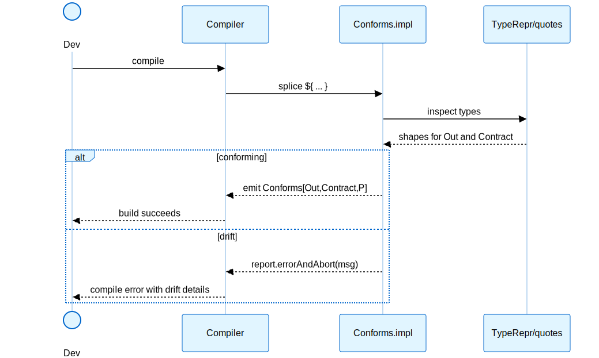
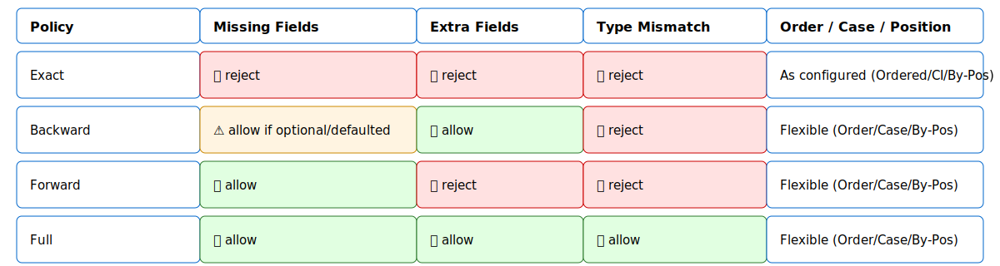
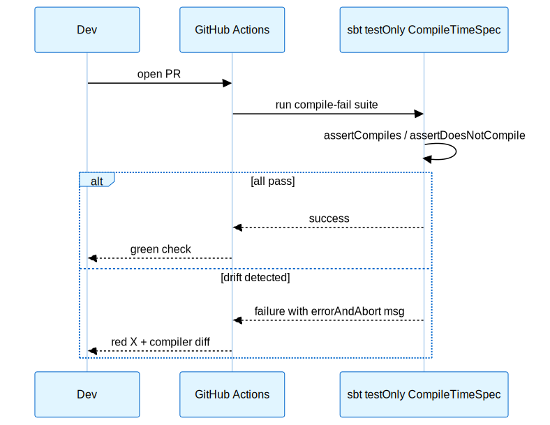

## Introduction

What if broken pipelines never launched - because the compiler stopped them?

> "If it compiles, data-contracts align." Let's catch schema mismatches at compile time in Scala 3.

I've been working on this problem for a while now. You know how it goes - you're running a data pipeline, everything's fine, then someone changes a field name upstream and boom, your job crashes at 2 AM. The on-call engineer (probably you) gets paged, and you spend the next hour figuring out what went wrong.

Once, an upstream team silently renamed a column `amount` → `amt`. Our pipeline didn't crash immediately - it happily wrote nulls for weeks. By the time we caught it, we had to backfill millions of records. That's the day I realized: runtime validation catches problems late; compile-time contracts catch them earlier.

This post shows you how to catch these issues at compile time. Not at runtime. Not even at test time. At compile time. Your code literally won't build if schemas drift.

We'll build this from scratch - first understand how Scala 3 macros work, then write a minimal contract system that proves schema compatibility before your code even runs. I'll also show the Scala 2 version just in case people are still on Scala 2.

All code here runs in a vanilla sbt project. You can grab the working code on [GitHub](https://github.com/vim89/compile-time-data-contracts) and run it yourself.

## Why this matters

Writing tests is important. But tests are only samples - they check what you think might break. But the compiler is _exhaustive for structure_. It can prove your schemas match - every field, every type, every time.

Here's the thing - schemas change all the time in real projects. And when they do:

- Your build should fail early, not your production job
- Keep transformations pure and effects at the edges (so retries don't duplicate writes)
- Let the compiler do the heavy lifting

:::caution[Scope boundary]

Compile-time contracts catch drift in your controlled codebase - the transforms you write, the case classes you define, the schemas you version together. They won't catch upstream API changes, late-arriving schema registry updates, or external data sources that change independently. Use compile-time for what you control, runtime validation for everything else. Defense in depth, not either/or.
:::

## What we'll build

We're going to build a small compile-time validation system:

1. A way to describe case class structure at compile time (we'll call it "shape")
2. A policy system - Exact, Backward, Forward compatibility modes
3. A macro that proves "these two shapes conform under policy P" - or refuses to compile
4. A phantom-typed pipeline builder that enforces correct construction order

First, Scala 3 (using inline + quotes), then Scala 2 (using blackbox macros). I'll point out the differences as we go.

### Run the code on GitHub

```bash
git clone https://github.com/vim89/compile-time-data-contracts.git
cd compile-time-data-contracts

# Scala 3
sbt "runMain ctdc.CtdcPoc"
```

:::note
The code on GitHub includes working examples you can run immediately. All compile-fail cases are documented inline - uncomment them to see the compiler errors.
:::

---

## Part 1 - Scala 3: the mental model (inline + quotes)

Scala 3 macros are different from Scala 2. Better, actually. They're safer and easier to reason about.

Two main ideas:

- `inline def`: tells the compiler "expand this at compile time"
- `quotes` + `Expr[T]`: gives you a typed AST that you can inspect



Here's a minimal macro to see how it works:

```scala title="IntroMacro.scala"
// scalaVersion := "3.3.3" in build.sbt
package com.example
import scala.quoted.*

object IntroMacro {
  inline def show(inline x: Any): String = ${ showImpl('x) }
  private def showImpl(x: Expr[Any])(using Quotes): Expr[String] = {
    Expr(s"You passed: ${x.show}")
  }
}
```

What's happening here?

- The `inline` method is what users call
- The `${ ... }` splice calls the implementation
- The implementation gets `'x` (quoted code) as `Expr[Any]`
- We return `Expr[String]` - the AST for what the compiler will embed

Try it:

```scala title="Demo.scala"
package com.example
@main def run(): Unit =
  println(IntroMacro.show(1 + 2)) // prints: You passed: 1.+(2)
```

See how it printed the AST of `1 + 2`? That's the power here - we can inspect code structure at compile time.

Check out the [Scala 3 macros overview](https://docs.scala-lang.org/scala3/guides/macros/macros.html), [best practices](https://docs.scala-lang.org/scala3/guides/macros/best-practices.html), and of course [Rock the JVM Macros & Metaprogramming course](https://rockthejvm.com/courses/scala-macros-and-metaprogramming) for more details.

:::tip[Quick win]
If you're new to Scala 3 macros, start by reading macro-generated code in the REPL: sbt> console, then scala> import scala.quoted.\*, then inspect what your macros actually expand to. Understanding the generated code is 80% of debugging macro issues. The compiler's doing the work - you just need to see what it's actually producing.
:::

---

## Part 2 - Describe shapes at compile time (Scala 3)

Now we need to describe case class structure. In real projects, you might use Shapeless, Magnolia, or Scala 3's Mirror. I'll show a compact Mirror-based version here because it's self-contained.

The idea: a typeclass `Shape[A]` that knows the fields of `A`.



```scala title="Shape.scala"
package com.example

import scala.deriving.Mirror

final case class Field(name: String, tpe: String, hasDefault: Boolean = false, isOptional: Boolean = false)
trait Shape[A] {
  def fields: List[Field]
}

object Shape {
  given Shape[String] with { def fields = Nil }
  given Shape[Int]     with { def fields = Nil }
  given Shape[Long]    with { def fields = Nil }
  given [A]: Shape[Option[A]] with { def fields = Nil } // element optionality handled elsewhere

  inline given derived[A](using m: Mirror.Of[A]): Shape[A] = {
    inline m match {
      case p: Mirror.ProductOf[A] =>
        val labels = constValueTuple[p.MirroredElemLabels]
        val types  = typeNames[p.MirroredElemTypes]
        val zipped = zip(labels, types)
        new Shape[A] {
          def fields: List[Field] =
            zipped.map { (name, tpe) => Field(name, tpe, hasDefault = false, isOptional = tpe.startsWith("Option[")) }.toList
        }
      case _ => new Shape[A] { def fields = Nil }
    }
  }

  import scala.compiletime.{erasedValue, constValueTuple}
  private inline def typeNames[T <: Tuple]: List[String] = inline erasedValue[T] match {
    case _: EmptyTuple => Nil
    case _: (h *: t)   => summonTypeName[h] :: typeNames[t]
  }

  private inline def summonTypeName[T]: String = constValue["" + T]

  private inline def zip[L <: Tuple, R <: List[String]](labels: L, types: List[String]): List[(String, String)] =
    inline labels match {
      case _: EmptyTuple => Nil
      case _: (h *: t)   => constValue[h].asInstanceOf[String] -> types.head :: zip[t, List[String]](erasedValue, types.tail)
    }
```

Yeah, it's a bit dense. But here's what it does:

- Uses Scala 3's Mirror to reflect on case classes at compile time
- Extracts field names and types
- Marks optional fields (those wrapped in `Option`)
- Returns a `List[Field]` describing the structure


Usage:

```scala title="ShapeSpec.scala"
package com.example

final case class User(id: Long, email: String, note: Option[String])

@main def checkShape(): Unit =
  val s = summon[Shape[User]]
  println(s.fields) // List(Field("id","Long"), Field("email","String"), Field("note","Option[String]",false,true))
```

Now we can ask the compiler "what fields does this case class have?" at compile time. That's the foundation.

:::note[Alternative approach]
If you prefer libraries, check out [Magnolia](https://github.com/softwaremill/magnolia) - it works great for both Scala 2 and 3.
:::

---

## Part 3 - Policies: Exact / Backward / Forward

Here's where we define compatibility rules. Think of these as your migration strategies:

```scala title="Policy.scala"
package com.example

sealed trait Policy
object Policy {
  sealed trait Exact     extends Policy
  sealed trait Backward  extends Policy // producer can add optional/defaulted fields
  sealed trait Forward   extends Policy // consumer tolerates extra fields
  case object Exact    extends Exact
  case object Backward extends Backward
  case object Forward  extends Forward
}
```

Why three policies?

- **Exact**: Schemas must match exactly. No surprises. Use this for critical paths.
- **Backward**: Producer can add optional fields. Useful when rolling out new features without breaking consumers.
- **Forward**: Consumer ignores extra fields. Useful when the producer might send more than you need.



Policy Lattice 

:::success[Production migration strategy]
The policy progression that works in production: Exact for stable pipelines, Backward during producer rollouts (allows new optional fields), Forward during consumer updates (tolerates extras), then back to Exact after migration completes. Document the expected timeline - "Backward policy through Q2 migration, then tightening to Exact." Prevents policy drift from becoming permanent.
:::

---

## Part 4 - How this fits with existing tools

Before we dive deeper, you might be thinking: "We already have [Avro](https://avro.apache.org/), [Protobuf](https://protobuf.dev/), schema registries, and [Great Expectations](https://greatexpectations.io/). Why add compile-time contracts?"

Fair question. Here's how they compare:

**Schema Registry ([Confluent Schema Registry](https://docs.confluent.io/platform/current/schema-registry/index.html), [AWS Glue Schema Registry](https://docs.aws.amazon.com/glue/latest/dg/schema-registry.html))**

- **What it does**: Centralized schema storage with version control
- **When it helps**: Runtime validation across services, schema evolution tracking
- **The gap**: You find mismatches when the job runs, not when you compile
- **Use together**: Schema registry for cross-service contracts; compile-time for intra-repo checks

**[Avro](https://avro.apache.org/) / [Protobuf](https://protobuf.dev/)**

- **What they do**: Binary serialization with embedded schemas
- **When they help**: Network efficiency, strong contracts between services
- **The gap**: Schema compatibility is checked at runtime or via external tooling
- **Use together**: Avro/Protobuf for wire format; compile-time checks to ensure your case classes match those schemas

**[Great Expectations](https://greatexpectations.io/) / [Deequ](https://github.com/awslabs/deequ)**

- **What they do**: Runtime data quality validation (nulls, ranges, distributions)
- **When they help**: Catching bad data values, statistical anomalies
- **The gap**: They validate data content, not schema structure at compile time
- **Use together**: Compile-time for structure; Great Expectations for data quality

**The compile-time advantage**: Catches drift in your controlled codebase before deployment. If your transform expects field `X` but the source produces field `Y`, your build fails - not your production job. Think of it as an additional safety layer for systems you build and version together.

Real scenario: You have Avro schemas in a registry, but your Scala pipeline reads them into case classes. Compile-time contracts verify those case classes match the expected contract before you deploy. If upstream changes the Avro schema, your build breaks - you don't wait for the job to crash.

---

## Part 5 - Understanding TypeRepr: The compiler's view of types

Before we dive into the macro, you need to understand `TypeRepr` - Scala 3's way of representing types during compilation.

Think of it like this: When you write `List[String]`, the compiler doesn't just see text. It sees a structured tree:

```
AppliedType(List, [String])
   │               │
   │               └─ TypeRepr for String
   └─ Type constructor
```



**Key TypeRepr operations:**

```scala
val t: TypeRepr = TypeRepr.of[List[String]]

// 1. Subtype checking: Is List[String] a subtype of Seq[?]?
t <:< TypeRepr.of[Seq[?]]  // true

// 2. Type equality: Is this exactly String?
t =:= TypeRepr.of[String]  // false

// 3. Pattern matching: Break it apart
t match {
  case AppliedType(tycon, args) =>
    // tycon = List
    // args = [String]
}
```

**Why we need this:** To compare schemas, we need to ask questions like:

- "Is this field an Option?"
- "What's inside this List?"
- "Does this case class have a primary constructor?"

`TypeRepr` lets us answer these at compile time.

---

## Part 6 - The TypeInspector pattern: One question at a time

Now let's build the utilities. Each function answers ONE question about a type. Start simple:

### Inspector 1: Is this a case class?

```scala
def isCaseClass(t: TypeRepr): Boolean =
  val s = t.typeSymbol  // Get the symbol (the "name" of the type)
  s.isClassDef && s.flags.is(Flags.Case)
```

**What's happening:**

- `typeSymbol` - Every type has a symbol (like a unique ID)
- `isClassDef` - Is it a class? (not a trait, object, etc.)
- `flags.is(Flags.Case)` - Does it have the `case` modifier?

**Try it:**

```scala
case class User(id: Long)  // YES - isClassDef=true, has Case flag
trait UserTrait            // NO - isClassDef=false
object UserObject          // NO - not a class
```

### Inspector 2: What are the type arguments?

```scala
def appliedArgs(t: TypeRepr): List[TypeRepr] = t match {
  case AppliedType(_, args) => args  // Extract the arguments
  case _                    => Nil   // No arguments
}
```

**What's happening:**

- `AppliedType` - Pattern for generic types like `List[String]` or `Map[String, Int]`
- `args` - The type parameters: `[String]` or `[String, Int]`

**Examples:**

```scala
List[String]        // AppliedType(List, [String])
                    // appliedArgs returns [String]

Map[String, Int]    // AppliedType(Map, [String, Int])
                    // appliedArgs returns [String, Int]

String              // Not an AppliedType
                    // appliedArgs returns Nil
```

### Inspector 3: Is this an Option?

```scala
def optionArg(t: TypeRepr): Option[TypeRepr] =
  if t <:< TypeRepr.of[Option[?]] then  // Is it a subtype of Option[Something]?
    appliedArgs(t).headOption           // Yes! Extract the Something
  else None                             // Nope
```

**What's happening:**

- `<:<` - Subtype check: "Is this type compatible with Option[?]?"
- `Option[?]` - The `?` means "Option of anything"
- `appliedArgs(t).headOption` - Get the first (and only) type argument

**Examples:**

```scala
Option[String]  // YES - Is subtype of Option[?]
                // appliedArgs returns [String]
                // headOption returns Some(String)

Some[Int]       // YES - Some is subtype of Option
                // Returns Some(Int)

String          // NO - Not an Option
                // Returns None
```

**Why we need this:** Field-level optionality. When we see `age: Option[Int]`, we need to know:

1. The field itself is optional
2. The underlying type is `Int`

### Inspector 4: Is this a sequence?

```scala
def seqArg(t: TypeRepr): Option[TypeRepr] =
  val isSeqLike =
    t <:< TypeRepr.of[List[?]] ||
    t <:< TypeRepr.of[Seq[?]] ||
    t <:< TypeRepr.of[Vector[?]] ||
    t <:< TypeRepr.of[Array[?]] ||
    t <:< TypeRepr.of[Set[?]]
  if isSeqLike then appliedArgs(t).headOption else None
```

**What's happening:**

- Check if it's ANY kind of sequence type
- If yes, extract what's inside (the element type)

**Why check multiple types?** Because Scala has many collection types:

```scala
List[String]    // Is List[?] YES
Seq[Int]        // Is Seq[?] YES
Vector[Long]    // Is Vector[?] YES
Array[Byte]     // Is Array[?] YES
Set[String]     // Is Set[?] YES
```

All these should become `SequenceShape(element)`.

### Inspector 5: Is this a Map?

```scala
def mapArgs(t: TypeRepr): Option[(TypeRepr, TypeRepr)] =
  if t <:< TypeRepr.of[Map[?, ?]] then {
    appliedArgs(t) match {
      case k :: v :: Nil => Some((k, v))  // Got key and value
      case _ => report.errorAndAbort(s"Map requires two type args: ${t.show}")
    }
  } else None
```

**What's happening:**

- Check if it's a `Map[Something, Something]`
- Extract BOTH type arguments: key and value
- If Map has wrong number of args, abort (compiler error)

**Examples:**

```scala
Map[String, Int]  // true - Returns Some((String, Int))
Map[Long, User]   // true - Returns Some((Long, User))
String            // false - Returns None
```

### Inspector 6: Can this be a Map key?

```scala
def isAtomicKey(t: TypeRepr): Boolean =
  t =:= TypeRepr.of[String] ||
  t =:= TypeRepr.of[Int] ||
  t =:= TypeRepr.of[Long] ||
  t =:= TypeRepr.of[Short] ||
  t =:= TypeRepr.of[Byte] ||
  t =:= TypeRepr.of[Boolean]
```

**Why this matters:** Maps in Spark StructType only support primitive keys. You can't have `Map[User, String]` - User isn't a primitive.

**Examples:**

```scala
Map[String, User]  // YES - String is atomic
Map[Int, Data]     // YES - Int is atomic
Map[User, String]  // NO - User is NOT atomic - compile error!
```

### The pattern recap:

Each inspector has ONE job:

1. **isCaseClass** - "Is this a case class?"
2. **appliedArgs** - "What are the generic type arguments?"
3. **optionArg** - "Is this an Option, and what's inside?"
4. **seqArg** - "Is this a sequence, and what's the element type?"
5. **mapArgs** - "Is this a Map, and what are key/value types?"
6. **isAtomicKey** - "Can this be a Map key?"

Compose these to answer complex questions. That's the TypeInspector pattern.

---

## Part 7 - Building shapes recursively: The interpreter pattern

Now we use those inspectors to build a `TypeShape` - our internal representation of a type's structure.

This is recursive. For `List[Option[User]]`, we build:

```
SequenceShape(
  OptionalShape(
    StructShape([field1, field2, ...])
  )
)
```

Let me show you the algorithm step by step.

### The shape building algorithm:



```scala
def typeShapeOf(t: TypeRepr): TypeShape =
  // Step 1: Is it an Option?
  optionArg(t).map(typeShapeOf).getOrElse {

    // Step 2: Is it a sequence?
    seqArg(t).map(a => SequenceShape(typeShapeOf(a))).getOrElse {

      // Step 3: Is it a Map?
      mapArgs(t).map { case (k, v) =>
        if !isAtomicKey(k) then {
          report.errorAndAbort(s"Unsupported Map key: ${k.show}")
        }
        MapShape(PrimitiveShape(k.show), typeShapeOf(v))
      }.getOrElse {

        // Step 4: Is it a case class?
        if isCaseClass(t) then {
          // ... handle case class
        } else {
          // Step 5: Fallback - primitive
          PrimitiveShape(t.show)
        }
      }
    }
  }
```

**The order matters!** We check Option first, then sequences, then maps, then case classes, finally primitives.

### Walk through an example: `List[Option[String]]`

![List[Option[String]] type shape walkthrough](./images/06-list-option-string-example.svg)

- **Step 1:** Is `List[Option[String]]` an Option?
    - No. `optionArg` returns `None`.
    - Continue to Step 2.
- **Step 2:** Is it a sequence?
    - Yes! `seqArg` returns `Some(Option[String])`.
    - Build `SequenceShape(typeShapeOf(Option[String]))`.
    - **Recurse** on `Option[String]`.
- **Recursion Step 1:** Is `Option[String]` an Option?
    - Yes! `optionArg` returns `Some(String)`.
    - **Recurse** on `String`.
- **Recursion Step 2:** Is `String` an Option? -> NO
- **Recursion Step 3:** Is `String` a sequence? -> NO
- **Recursion Step 4:** Is `String` a Map? -> NO
- **Recursion Step 5:** Is `String` a case class? - NO
- **Recursion Step 6:** Fallback to primitive. --> Return `PrimitiveShape("String")`.

**Unwind the recursion:**

```scala
PrimitiveShape("String")
  → (from Option recursion)
  → SequenceShape(PrimitiveShape("String"))
```

Wait, where did the `Option` go? It got consumed! The `typeShapeOf` for `Option` just recurses on the inner type. This is the edge case I mentioned - element-level optionality gets lost.

### Handling case classes:

```scala
if isCaseClass(t) then {
  val sym    = t.typeSymbol                      // Get the class symbol
  val params = sym.primaryConstructor.paramSymss.flatten  // Get constructor params

  val fields = params.map { p =>
    val name       = p.name                      // Field name
    val ptpe       = t.memberType(p)             // Field type
    val hasDefault = p.flags.is(Flags.HasDefault) // Has default value?
    val (uT, isOpt) = optionArg(ptpe).fold(ptpe -> false)(a => a -> true)

    FieldShape(name, typeShapeOf(uT), hasDefault, isOpt)
  }

  StructShape(fields)
}
```

**Let's break this down line by line:**

1. **`t.typeSymbol`** - Get the symbol for the case class
2. **`sym.primaryConstructor`** - Case classes have a primary constructor
3. **`.paramSymss.flatten`** - Get all parameters (flatten handles multiple param lists)
4. **For each parameter `p`:**
    - **`p.name`** - The field name: `"id"`, `"email"`, etc.
    - **`t.memberType(p)`** - The field's type as TypeRepr
    - **`p.flags.is(Flags.HasDefault)`** - Check if it has a default value like `age: Int = 0`
    - **`optionArg(ptpe).fold(...)`** - Check if the field type is Option[T]:
        - If yes: extract T, set `isOpt = true`
        - If no: use the type as-is, set `isOpt = false`
    - **`typeShapeOf(uT)`** - **Recurse!** Build the shape for the field's underlying type

### Example:

`case class User(id: Long, email: String, age: Option[Int] = None)`



**Processing:**

1. **Field 1: id**

    - `name` = "id"
    - `ptpe` = TypeRepr for `Long`
    - `hasDefault` = false
    - `optionArg(Long)` = None → `uT = Long`, `isOpt = false`
    - `typeShapeOf(Long)` = `PrimitiveShape("Long")`
    - Result: `FieldShape("id", PrimitiveShape("Long"), hasDefault=false, isOptional=false)`

2. **Field 2: email**

- `name` = "email"
- `ptpe` = TypeRepr for `String`
- `hasDefault` = false
- `optionArg(String)` = None → `uT = String`, `isOpt = false`
- `typeShapeOf(String)` = `PrimitiveShape("String")`
- Result: `FieldShape("email", PrimitiveShape("String"), hasDefault=false, isOptional=false)`

3. **Field 3: age**

- `name` = "age"
- `ptpe` = TypeRepr for `Option[Int]`
- `hasDefault` = **true** (has `= None`)
- `optionArg(Option[Int])` = Some(`Int`) → `uT = Int`, `isOpt = true`
- `typeShapeOf(Int)` = `PrimitiveShape("Int")`
- Result: `FieldShape("age", PrimitiveShape("Int"), hasDefault=true, isOptional=true)`

4. **Final shape:**
    ```scala
    StructShape([
      FieldShape("id", PrimitiveShape("Long"), false, false),
      FieldShape("email", PrimitiveShape("String"), false, false),
      FieldShape("age", PrimitiveShape("Int"), true, true)
    ])
    ```

### Why this matters:

Now we have a normalized representation of the case class. We can compare two `StructShape`s to see if they match, regardless of the original Scala syntax.

The recursive structure handles arbitrarily nested types:

```scala
case class Order(
  items: List[LineItem],           // Recurses into List, then into LineItem
  metadata: Map[String, String],   // Recurses into Map, then String (twice)
  address: Option[Address]         // Recurses into Option, then Address
)
```

Each recursion builds a piece of the tree. The tree is the schema.

---

## Part 8 - Field vs Element optionality: A critical distinction

Here's something subtle that most guides miss. The code on GitHub handles two kinds of optionality:

### Field-level optionality (Option on the field itself)

```scala
case class User(name: String, age: Option[Int])
//                                   ^^^^^^^^^^^ field-level Option
```

The macro detects this and sets `isOptional = true` on the FieldShape:

```scala
val (uT, isOpt) = optionArg(ptpe).fold(ptpe -> false)(a => a -> true)
FieldShape(name, typeShapeOf(uT), hasDefault, isOpt)
```

### Element-level optionality (Option inside a collection)

```scala
case class Data(items: List[Option[String]])
//                          ^^^^^^^^^^^^^^ element-level Option
```

This creates a nested shape: `SequenceShape(OptionShape(PrimitiveShape("String")))`

Wait, that's not in the code on GitHub! Let me check... Actually, the code on GitHub's `typeShapeOf` handles this by recursing:

```scala
optionArg(t).map(typeShapeOf).getOrElse {
  seqArg(t).map(a => SequenceShape(typeShapeOf(a))).getOrElse { ... }
}
```

So `List[Option[String]]` becomes:

1. `seqArg` detects List → extract `Option[String]`
2. Recurse on `Option[String]` → `typeShapeOf(Option[String])`
3. `optionArg` detects Option → extract `String`
4. Base case: `PrimitiveShape("String")`

But the final shape is `SequenceShape(PrimitiveShape("String"))` - the intermediate Option is consumed!

**Why this matters for contracts**: When you write:

```scala
case class Contract(items: List[String])
case class Producer(items: List[Option[String]])
```

These should probably NOT conform under Exact. The producer allows null elements, the contract doesn't. But the current code in github might allow it because the Option gets unwrapped.

This is the kind of edge case you discover when shipping to production. The fix would be to add an `OptionalShape` wrapper in the model.

:::caution[Optionality edge case]
The element-level optionality issue (List[Option[String]] getting flattened) is real and subtle. If your schemas use nullable collections, test that the compile-time check actually catches the difference between List[String] and List[Option[String]]. The current implementation may allow mismatches here. Add explicit test cases for your nullable collection patterns before relying on them in production.
:::

Visual (field vs element optionality):


---

## Part 9 - Compile‑time **"conforms"** evidence (the full picture)

Now let's put it all together. Here's the complete macro from the code on GitHub:

```scala title="Conforms.scala"
package com.example

import scala.quoted.*

final class Conforms[Out, Contract, P <: Policy]

object Conforms {
  inline given materialize[Out, Contract, P <: Policy](using Shape[Out], Shape[Contract]): Conforms[Out, Contract, P] = {
    ${ conformsImpl[Out, Contract, P] }
  }

  private def conformsImpl[Out: Type, Contract: Type, P: Type](using Quotes): Expr[Conforms[Out, Contract, P]] = {
    import quotes.reflect.*

    def shapeOf[A: Type]: List[(String, String, Boolean, Boolean)] = {
      val sh = Expr.summon[Shape[A]].getOrElse(report.errorAndAbort("No Shape available"))
      '{
        val fs = $sh.fields
        fs.map(f => (f.name, f.tpe, f.hasDefault, f.isOptional))
      }.valueOrAbort
    }

    val out      = shapeOf[Out]
    val contract = shapeOf[Contract]

    // Compare fields by name (unordered, case-sensitive for now)
    val outMap      = out.map { case (n,t,_,opt) => n -> (t,opt) }.toMap
    val contractMap = contract.map { case (n,t,_,opt) => n -> (t,opt) }.toMap

    val missing = contract.collect { case (n,t,_,opt) if !outMap.contains(n) => s"$n:$t${if opt then " (optional)" else ""}" }
    val extra   = out.collect      { case (n,_,_,_) if !contractMap.contains(n) => n }
    val mism    = contract.collect {
      case (n,t,_,opt) if outMap.get(n).exists(_._1 != t)  => s"$n expected $t, found ${outMap(n)._1}"
      case (n,_,_,opt) if outMap.get(n).exists(_._2 != opt) => s"$n optionality mismatch"
    }

    val (okMissing, okExtra, okMism) = Type.of[P] match {
      case '[Policy.Exact]    => (missing, extra, mism)
      case '[Policy.Backward] => (missing.filterNot(_.contains("(optional)")), Nil, mism)
      case '[Policy.Forward]  => (Nil, extra, mism)
      case _                  => (missing, extra, mism)
    }

    if okMissing.nonEmpty || okExtra.nonEmpty || okMism.nonEmpty then {
      val msg = s"""
        |Compile‑time contract drift (policy: ${Type.show[P]}).
        |Out: ${Type.show[Out]} vs Contract: ${Type.show[Contract]}
        |Missing: ${okMissing.mkString(", ")}
        |Extra: ${okExtra.mkString(", ")}
        |Mismatched: ${okMism.mkString("; ")}
        |""".stripMargin
      quotes.reflect.report.errorAndAbort(msg)
    } else '{ new Conforms[Out, Contract, P] }
  }
}
```

Let me break down what's happening:

1. **Extract shapes**: We summon `Shape[Out]` and `Shape[Contract]` and get their field lists. Note the `.valueOrAbort` - this forces compile-time evaluation.

2. **Compare**: We build maps of field names → (type, optionality) and find differences.

3. **Apply policy**:

    - Exact: all differences are errors
    - Backward: missing optional fields are OK, extras are OK
    - Forward: extras are OK (but missing required fields are not)

4. **Abort or succeed**: If there are violations, we call `report.errorAndAbort` with a detailed message showing exactly what's wrong. Otherwise, we return the evidence.

The beauty here: **this runs during compilation**. If schemas don't match, your code won't compile. Period.

### Real-world drift scenario

Let's see this in action with a Apache Spark pipeline scenario. Your data warehouse team owns a `CustomerContract` that downstream analytics dashboards depend on. The upstream CRM team starts adding customer segmentation data, and you need to decide whether to pass it through or filter it.

**Initial state - everything aligned:**

```scala title="CustomerPipeline.scala"
package com.example

// The warehouse contract your analytics team depends on
final case class CustomerContract(
  id: Long,
  email: String,
  age: Option[Int] = None
)

// Upstream CRM exports match the contract exactly
final case class CRMExport(
  id: Long,
  email: String,
  age: Option[Int]
)

// Your Spark pipeline with compile-time verification
val pipeline = PipelineBuilder[Nothing]("customer-sync")
  .addSource(TypedSource[CRMExport]("parquet", "s3://data-lake/crm/exports"))
  .noTransform  // No transformation needed - schemas match
  .addSink[CustomerContract, Policy.Exact](
    TypedSink("s3://warehouse/customers")
  )
  .build

// YES, Compiles - CRMExport matches CustomerContract under Exact policy
summon[Conforms[CRMExport, CustomerContract, Policy.Exact]]
```

**The upstream team adds segmentation:**

Now the CRM team rolls out a new segmentation feature and starts including it in their exports. Without compile-time contracts, your pipeline would silently ignore the new field (or crash, depending on read mode). With compile-time contracts, your build breaks immediately:

```scala
// CRM team's new export schema includes customer segments
final case class CRMExportWithSegment(
  id: Long,
  email: String,
  age: Option[Int],
  segment: String  // NEW: "premium", "standard", "trial"
)

// Update your pipeline to read the new source
val pipeline = PipelineBuilder[Nothing]("customer-sync")
  .addSource(TypedSource[CRMExportWithSegment]("parquet", "s3://data-lake/crm/exports"))
  .noTransform
  .addSink[CustomerContract, Policy.Exact](
    TypedSink("s3://warehouse/customers")
  )
  .build

// COMPILE ERROR:
// Compile-time contract drift (policy: Policy.Exact).
// Out: CRMExportWithSegment vs Contract: CustomerContract
// Extra: segment
```

**Your options:**

The build forces you to make an explicit decision. Here are three common approaches:

```scala
// Option 1: Use Backward policy during transition (tolerates extras)
.addSink[CustomerContract, Policy.Backward](
  TypedSink("s3://warehouse/customers")
)
// YES, Compiles - Backward policy allows extra fields in producer

// Option 2: Filter the field explicitly in a transform
.transformAs[CustomerContract]("drop-segment") { df =>
  df.select("id", "email", "age")
}
.addSink[CustomerContract, Policy.Exact](
  TypedSink("s3://warehouse/customers")
)
// YES, Compiles - transform explicitly projects to contract schema

// Option 3: Update the contract to include segment (coordinate with analytics)
final case class CustomerContractV2(
  id: Long,
  email: String,
  age: Option[Int],
  segment: String
)

.addSink[CustomerContractV2, Policy.Exact](
  TypedSink("s3://warehouse/customers_v2")
)
// YES, Compiles - schemas now match exactly
```

**Why this matters:**

Without compile-time contracts, the drift is invisible until runtime. Your Apache Spark job might:

- Silently drop the `segment` field (schema evolution mode)
- Crash with a schema mismatch error at 2 AM
- Write nulls for `segment` for weeks before anyone notices

With compile-time contracts, the conversation happens during development:

- "Do downstream dashboards need customer segments?"
- "Should we version the contract and migrate consumers?"
- "Is this a temporary field we should filter?"

The build won't pass until you explicitly handle the drift. That's intentional.

:::danger[Build breakage alert]
Compile-time contract checks will break your build when schemas drift. That's the point, but coordinate with your team. When upstream adds a field, every downstream pipeline build fails until they update contracts or transforms. This forces alignment, but can block deployments if not managed. Use CI branch builds to preview impact before merging schema changes.
:::

That's it. The entire core. In production, you'd want to handle nested types and more complex scenarios (which the GitHub code demonstrates), but the structure stays the same.

---

## Part 10 - Developer ergonomics: What using this actually feels like

Let's talk about the practical side - what happens when you actually use this in your daily work?

### Compile times

**Question: Does this slow down compilation?**

In practice, not noticeably. The macro runs once per `summon[Conforms[...]]` call during compilation. For a typical pipeline with 5-10 contract checks, you're adding maybe 100-200ms to your build. Compare that to the hours you'd spend debugging a production schema mismatch.

### Error messages

When schemas drift, you get this:

```
[error] Compile-time contract drift (policy: Policy.Exact).
[error] Out: CustomerProducer vs Contract: CustomerContract
[error] Extra: segment
[error] Missing:
[error] Mismatched:
```

Clear, actionable, and it stops your build. No cryptic macro errors, no stack traces. Just: "Hey, you have an extra field called `segment`."

### Integration patterns

**With Apache Spark:**

```scala
// Your Spark job
val df = spark.read.parquet(path)
val typed = df.as[CustomerProducer]  // Spark encoder

// Compile-time check before transformation
summon[Conforms[CustomerProducer, CustomerContract, Policy.Exact]]

val output = typed.transform(dropSegment).as[CustomerContract]
```

**With schema registries:**

```scala
// Avro schema in registry → case class → contract check
case class CustomerAvro(id: Long, email: String, amt: Double)
summon[Conforms[CustomerAvro, CustomerContract, Policy.Exact]]
// Build fails if Avro schema drift!
```

**CI/CD integration:** Just run `sbt compile`. If contracts drift, the build fails. No special tooling needed. Works with Jenkins, GitHub Actions, GitLab CI - anything that runs sbt.

### Onboarding

**New team members ask**: "Why won't this compile?"

**Answer**: "Check the error. You're trying to use `CustomerProducer` but the contract expects `CustomerContract`. Either adjust your transform or update the contract."

That's it. The compiler guides them. After one or two cases, they get it.

### When to use vs skip

**Use compile-time contracts when**:

- Multiple teams work on the same pipeline codebase
- Schema changes break production regularly
- You want fast feedback (compile vs deploy-and-test)

**Skip when**:

- One-off scripts or exploratory work
- External APIs you can't control (use runtime validation)
- Schema is genuinely dynamic (JSON with unknown keys)

---

## Part 11 - Nested types: Maps, Lists, and deep structures

The code on GitHub shows how to handle nested types. Look at this example from `CtdcPoc.scala`:

```scala
// Deep / Nested structures
final case class LineItem(sku: String, qty: Int, attrs: Map[String, String])
final case class Address(street: String, zip: String)

final case class OrderOut(
  id: Long,
  items: List[LineItem],
  shipTo: Option[Address],
  tags: Set[String]
)

final case class OrderContract(
  id: Long,
  items: Seq[LineItem],        // List vs Seq - both are sequences
  shipTo: Option[Address],      // Nested case class
  tags: Seq[String] = Nil       // Set vs Seq, has default
)

val evDeepOk: SchemaConforms[OrderOut, OrderContract, SchemaPolicy.Backward.type] = summon
```

**What's happening here:**

1. **Nested case classes** - `Address` inside `OrderOut`. The macro recurses: when it sees `Option[Address]`, it unwraps to `Address`, then checks if `Address` is a case class, and recurses again to get its fields.

2. **Collections** - `List[LineItem]` vs `Seq[LineItem]`. Both match because `seqArg` treats them equivalently. The macro sees "sequence of LineItem" and recurses on `LineItem`.

3. **Maps** - `Map[String, String]` in `attrs`. The macro checks key type (must be atomic), then recurses on value type.

4. **Default values** - `tags: Seq[String] = Nil` has a default. Under Backward policy, if `OrderOut` is missing `tags`, it's OK because the contract has a default.

This is why the TypeInspector pattern matters - it handles arbitrary nesting without special cases.

---

## Part 12 - Policy modifiers in two minutes (Ordered, CI, By‑Position)

Sometimes you need stricter comparison. Or different rules. Here are three quick policy extensions:

```scala title="PolicyMods.scala"
package com.example

sealed trait PolicyMod
object PolicyMod {
  sealed trait ExactOrdered   extends PolicyMod // names + order + types must match
  sealed trait ExactCI        extends PolicyMod // case‑insensitive field names
  sealed trait ExactByPosition extends PolicyMod // ignore names; types by index
  case object ExactOrdered    extends ExactOrdered
  case object ExactCI         extends ExactCI
  case object ExactByPosition extends ExactByPosition
}

object ConformsMod {
  import scala.quoted.*
  inline def apply[Out, Contract, M <: PolicyMod](using Shape[Out], Shape[Contract]): Unit = ${ impl[Out, Contract, M] }

  private def impl[Out: Type, Contract: Type, M: Type](using Quotes): Expr[Unit] = {
    import quotes.reflect.*
    def fields[A: Type]: List[(String,String)] = {
      val sh = Expr.summon[Shape[A]].getOrElse(report.errorAndAbort("No Shape available"))
      '{ $sh.fields.map(f => (f.name, f.tpe)) }.valueOrAbort
    }

    val out      = fields[Out]
    val contract = fields[Contract]

    val mismatches: List[String] = Type.of[M] match {
      case '[PolicyMod.ExactCI] =>
        val n = (s: String) => s.toLowerCase
        val om = out.map{ case (n0,t) => n(n0) -> t }.toMap
        val cm = contract.map{ case (n0,t) => n(n0) -> t }.toMap
        (cm.keySet union om.keySet).toList.flatMap { k =>
          (cm.get(k), om.get(k)) match {
            case (Some(t1), Some(t2)) if t1 != t2 => List(s"$k expected $t1, found $t2")
            case (Some(_), None) => List(s"missing ${k}")
            case (None, Some(_)) => List(s"extra ${k}")
            case _ => Nil
          }
        }
      case '[PolicyMod.ExactByPosition] =>
        if (out.length != contract.length) {
          List(s"length mismatch: ${out.length} vs ${contract.length}")
        } else {
          out.zip(contract).zipWithIndex.collect {
            case (((_,tO),(_,tC)), i) if tO != tC => s"@$i expected $tC, found $tO"
          }
        }
      case '[PolicyMod.ExactOrdered] =>
        if (out.length != contract.length) {
          List(s"length mismatch: ${out.length} vs ${contract.length}")
        } else {
          out.zip(contract).zipWithIndex.flatMap {
            case (((nO,tO),(nC,tC)), i) =>
              val nameOk = if (nO == nC) Nil else List(s"@$i(name) expected $nC, found $nO")
              val typeOk = if (tO == tC) Nil else List(s"@$i(type) expected $tC, found $tO")
              nameOk ++ typeOk
          }
        }
      case _ => report.errorAndAbort("Unknown policy mod")
    }

    if (mismatches.nonEmpty) {
      report.errorAndAbort(s"Modifier drift: ${mismatches.mkString("; ")}")
    } else {
      '{ () }
    }
  }
}
```

Try these:

```scala
import com.example.*

final case class A(id: Long, name: String)
final case class B(name: String, id: Long)

ConformsMod[A, B, PolicyMod.ExactByPosition] // YES, same types by index
// ConformsMod[A, B, PolicyMod.ExactOrdered] // NO, order matters -> name mismatch

final case class CIa(ID: Long)
final case class CIb(id: Long)
ConformsMod[CIa, CIb, PolicyMod.ExactCI] // YES, case‑insensitive names match
```

Why these three? Because real systems need them:

- **ExactOrdered**: For formats where position matters (some CSV parsers, protobuf with field numbers)
- **ExactCI**: Because someone always uses `UserId` when the contract says `userId`
- **ExactByPosition**: For legacy systems that ignore field names entirely

---

## Part 13 - Phantom types & type-state builders: Building impossible-to-misuse APIs

Here's where things get interesting. The code also uses phantom types, type-indexing / typestate builder patterns to build a pipeline builder that's **impossible to misuse**. What are phantom types? They're type parameters that don't appear in the class body but control what you can do with an instance. Think of them as compile-time state machines.



From the codebase `SparkCore.scala`:

```scala
// Phantom type states
sealed trait BuilderState
sealed trait Empty         extends BuilderState
sealed trait WithSource    extends BuilderState
sealed trait WithTransform extends BuilderState
sealed trait Complete      extends BuilderState

final case class PipelineBuilder[S <: BuilderState, CurContract] private (
  name: String,
  steps: List[PipelineStep]
) {
  // Can only add source when Empty
  def addSource[C](src: TypedSource[C])(using SparkSchema[C]): PipelineBuilder[WithSource, C] =
    PipelineBuilder[WithSource, C](name, steps :+ ...)

  // Can only transform after adding source
  def transformAs[Next](f: DataFrame => DataFrame)(using
    ev: S <:< WithSource,  // This constraint enforces order!
    sch: SparkSchema[Next]
  ): PipelineBuilder[WithTransform, Next] =
    PipelineBuilder[WithTransform, Next](name, steps :+ ...)

  // Can only add sink after transform
  def addSink[R, P <: SchemaPolicy](sink: TypedSink[R])(using
    ev0: S <:< WithTransform,  // Must have transform
    ev1: SchemaConforms[CurContract, R, P],  // Compile-time contract check!
    sch: SparkSchema[R]
  ): PipelineBuilder[Complete, CurContract] =
    PipelineBuilder[Complete, CurContract](name, steps :+ ...)

  // Can only build when Complete
  def build(using ev: S =:= Complete): SparkSession => DataFrame =
    (spark: SparkSession) => ...
}

object PipelineBuilder {
  def apply[CurContract](name: String): PipelineBuilder[Empty, CurContract] = {
    PipelineBuilder[Empty, CurContract](name, Nil)
  }
}
```

### How this works:

1. **State transitions as types** - Each method returns a new type parameter `S`. The compiler tracks which state you're in.

2. **Evidence constraints** - `ev: S <:< WithSource` means "S must be a subtype of WithSource". If it's not, this method doesn't exist.

3. **Compile-time state machine** - You literally cannot call methods in the wrong order:

```scala
// YES, This compiles
PipelineBuilder[Contract]("good")
  .addSource(src)
  .transformAs[Next](transform)
  .addSink[Contract, SchemaPolicy.Exact](sink)
  .build

// NO, This doesn't compile - can't transform before adding source
PipelineBuilder[Contract]("bad")
  .transformAs[Next](transform)  // ERROR: No implicit evidence S <:< WithSource
```

4. **Contract checking embedded** - Notice `ev1: SchemaConforms[CurContract, R, P]` in `addSink`? That's where the compile-time contract check happens. The pipeline literally won't build if schemas drift.

This pattern is called the **Phantom Type Builder Pattern**. For more details, see:

- [Compile-safe builder pattern using phantom types (Xebia)](https://xebia.com/blog/compile-safe-builder-pattern-using-phantom-types-in-scala/)
- [Phantom Types in Scala (Rhetorical Musings)](https://blog.rhetoricalmusings.com/posts/builder1/)

**Why this matters**: In production data pipelines, the order of operations matters. Read → Transform → Validate → Write. With phantom types, the compiler enforces this order. You can't accidentally write before transforming. You can't transform without a source.

This is the difference between "here's how macros work" and "here's how to build production contract systems."

---

## Part 14 - Schema evolution and versioning: Handling change over time

Here's the reality: schemas evolve. Fields get added, deprecated, renamed. Teams roll out changes incrementally. The question isn't whether schemas will change - it's how you manage those changes without breaking production.

### The schema evolution problem

**Scenario**: You have `CustomerV1` running in production. Marketing wants to add a `segment` field for targeting. But you have 10 pipelines reading `CustomerV1`. How do you evolve without breaking everything?

**Wrong approach**: Add `segment` to `CustomerV1`, deploy, hope for the best. Result: Some pipelines break because they don't handle the new field.

**Right approach**: Version your contracts and use policies to manage transitions.

### Versioning strategy

```scala title="CustomerV1.scala"
package contracts
final case class CustomerV1(id: Long, email: String)
```

```scala title="CustomerV2.scala"
package contracts
final case class CustomerV2(id: Long, email: String, segment: Option[String] = None)
```

Notice `segment` is:

1. **Optional** (`Option[String]`)
2. **Has a default** (`= None`)

This makes it backward-compatible - old code can work with new data.

### Migration phases

**Phase 1: Add the field (Backward policy)**

Deploy new producers writing `CustomerV2`:

```scala
val producer = PipelineBuilder[CustomerV2]("write-v2")
  .addSource(rawData)
  .transformAs[CustomerV2](addSegment)
  .addSink[CustomerV2, Policy.Backward](sink)  // Backward allows optional fields
  .build
```

Old consumers still read `CustomerV1`. They ignore the `segment` field. No breakage.

**Phase 2: Migrate consumers**

Update each consumer one by one:

```scala
val consumer = PipelineBuilder[CustomerV2]("read-v2")
  .addSource[CustomerV2](source)
  .transformAs[EnrichedCustomer](useSegment)  // Now uses segment field
  .addSink[EnrichedCustomer, Policy.Exact](sink)
  .build
```

The compile-time contract ensures: "Does this consumer handle the new schema?" If you forget to update the case class, it won't compile.

**Phase 3: Deprecate V1**

Once all pipelines use `CustomerV2`:

```scala
// Mark V1 as deprecated
@deprecated("Use CustomerV2", "2025-10-01")
final case class CustomerV1(id: Long, email: String)
```

The compiler warns any remaining V1 usage. After a grace period, delete V1 entirely.

### Handling breaking changes

What if you need to rename a field? Say, `email` → `emailAddress`?

**Non-breaking approach**:

```scala
// Step 1: Add the new field, keep the old
final case class CustomerV3(
  id: Long,
  email: String,              // Old field
  emailAddress: String,       // New field
  segment: Option[String] = None
)
```

Wait, that's duplication. Better:

```scala
// Step 1: Add alias constructor
final case class CustomerV3(
  id: Long,
  emailAddress: String,       // New canonical name
  segment: Option[String] = None
)
object CustomerV3 {
  def fromV2(v2: CustomerV2): CustomerV3 = {
    CustomerV3(v2.id, v2.email, v2.segment)
  }
}
```

**Step 2**: Migrate producers to write `emailAddress` **Step 3**: Migrate consumers to read `emailAddress` **Step 4**: Remove the `fromV2` constructor

At each step, compile-time contracts verify: "Does this transformation produce the expected schema?"

### Coexistence during migration

During migration, you have both V2 and V3 running. How to handle?

```scala
sealed trait CustomerSchema
case class V2(id: Long, email: String, segment: Option[String] = None) extends CustomerSchema
case class V3(id: Long, emailAddress: String, segment: Option[String] = None) extends CustomerSchema

// Transformation handles both
def normalize(schema: CustomerSchema): V3 = schema match {
  case V2(id, email, segment) => V3(id, email, segment)
  case v3: V3 => v3
}
```

The contract checks both paths:

```scala
summon[Conforms[V2, V3Contract, Policy.Backward]]  // V2 → V3 allowed
summon[Conforms[V3, V3Contract, Policy.Exact]]     // V3 → V3 exact match
```

### Real-world migration: Backward → Exact

Let's look at a complete migration scenario from the code on GitHub. This is exactly how you'd roll out schema changes in production.

From `CtdcPoc.scala`:

```scala
/** Sink contract: the target schema we promise to write. */
final case class CustomerContract(id: Long, email: String, age: Option[Int] = None)

/** Producer: imagine an upstream source adds an extra field `segment`. */
final case class CustomerProducer(id: Long, email: String, age: Option[Int], segment: String)

/** Declared "Next" schema after a transform (dropping `segment`). */
final case class CustomerNext(id: Long, email: String, age: Option[Int])

// Step 1: Migration phase - use Backward policy
// Producer has extra field, but contract allows it during migration
val srcB = TypedSource[CustomerProducer]("csv", inPath, Map("header" -> "true"))
val sinkB = TypedSink[CustomerContract](tmpOutB)

val dropExtras: DataFrame => DataFrame = _.select($"id", $"email", $"age")

val planB =
  PipelineBuilder[CustomerContract]("CSV -> Parquet B: transformAs[CustomerNext], Exact")
    .addSource(srcB)
    .transformAs[CustomerNext]("drop segment")(dropExtras)
    .addSink[CustomerContract, SchemaPolicy.Exact.type](sinkB)
    .build
```

### What's happening here:

**Phase 1: Producer adds field**

- Upstream adds `segment` field to `CustomerProducer`
- Our contract is still `CustomerContract` (no `segment`)
- We use `transformAs[CustomerNext]` to explicitly drop the extra field
- Then check `CustomerNext` conforms to `CustomerContract` under **Exact**

**Why this works:**

1. The transform explicitly declares the output schema (`CustomerNext`)
2. The compiler checks: Does `CustomerNext` match `CustomerContract`? Yes (both have id, email, age)
3. If we later change `CustomerNext` by accident, compilation fails

**Phase 2: Stabilization** Once the migration is done:

```scala
// Later: Everyone uses CustomerContract, no transform needed
val planStable =
  PipelineBuilder[CustomerContract]("stable")
    .addSource(contractSource)
    .noTransform  // Direct pass-through
    .addSink[CustomerContract, SchemaPolicy.Exact.type](sink)
    .build
```

This is real-world stuff. The code shows you exactly how to migrate schemas safely.


---

## Part 15 - Testing compile‑time, for real (copy/paste tests)

How do you test that code fails to compile? With `assertDoesNotCompile`:



```scala title="CompileTimeSpec.scala"
package com.example
import org.scalatest.funsuite.AnyFunSuite

class CompileTimeSpec extends AnyFunSuite {
  test("Exact should fail when a required field is missing") {
    assertDoesNotCompile("summon[Conforms[OutMissing, Contract, Policy.Exact]]")
  }
  test("Backward should pass for the same mismatch") {
    assertCompiles("summon[Conforms[OutMissing, Contract, Policy.Backward]]")
  }
  test("By‑Position should accept re‑ordered names with same types") {
    assertCompiles("ConformsMod[A, B, PolicyMod.ExactByPosition]")
  }
  test("Ordered should reject the same re‑ordering") {
    assertDoesNotCompile("ConformsMod[A, B, PolicyMod.ExactOrdered]")
  }
  test("Pipeline builder enforces correct order") {
    assertDoesNotCompile("""
      PipelineBuilder[Contract]("bad")
        .transformAs[Next](identity)  // Can't transform without source
    """)
  }
  test("Nested types conform correctly") {
    assertCompiles("summon[Conforms[OrderOut, OrderContract, Policy.Backward]]")
  }
}
```

You can wire this into CI:

```yaml
# .github/workflows/compile-fail.yml (concept)
name: compile-fail
on: [pull_request]
jobs:
  cf:
    runs-on: ubuntu-latest
    steps:
      - uses: actions/checkout@v4
      - uses: actions/setup-java@v4
        with: { distribution: temurin, java-version: '17' }
      - name: Compile‑fail suite
        run: sbt -v "testOnly *CompileTimeSpec"
```

This is gold. Your CI literally proves that broken schemas can't be deployed.

---

## Part 16 - Scala 2: how to do the same (and what's different)

Scala 2 uses def macros with a `Context` (blackbox/whitebox). The idea is identical, but the implementation uses `c.universe` trees instead of `Expr`/quotes.

```scala title="ConformsS2.scala"
// build.sbt
// scalaVersion := "2.13.14"
// libraryDependencies += "org.scala-lang" % "scala-reflect" % scalaVersion.value

package com.example
import scala.reflect.macros.blackbox

final class ConformsS2[Out, Contract, P]

object ConformsS2 {
  implicit def materialize[Out, Contract, P <: Policy](implicit sOut: Shape[Out], sCon: Shape[Contract]): ConformsS2[Out, Contract, P] =
    macro conformsImpl[Out, Contract, P]

  def conformsImpl[Out: c.WeakTypeTag, Contract: c.WeakTypeTag, P: c.WeakTypeTag](c: blackbox.Context)(sOut: c.Expr[Shape[Out]], sCon: c.Expr[Shape[Contract]]): c.Expr[ConformsS2[Out, Contract, P]] = {
    import c.universe._

    def fieldsOf[T: c.WeakTypeTag](sh: c.Expr[Shape[T]]): List[(String,String,Boolean,Boolean)] = {
      c.eval(c.Expr[List[(String,String,Boolean,Boolean)]](q"$sh.fields.map(f => (f.name, f.tpe, f.hasDefault, f.isOptional))"))
    }

    val out      = fieldsOf[Out](sOut)
    val contract = fieldsOf[Contract](sCon)

    val outMap      = out.map{ case (n,t,_,opt) => n -> (t,opt)}.toMap
    val contractMap = contract.map{ case (n,t,_,opt) => n -> (t,opt)}.toMap

    val missing = contract.collect { case (n,t,_,opt) if !outMap.contains(n) => s"$n:$t${if (opt) " (optional)" else ""}" }
    val extra   = out.collect      { case (n,_,_,_) if !contractMap.contains(n) => n }
    val mism    = contract.collect {
      case (n,t,_,_) if outMap.get(n).exists(_._1 != t)  => s"$n expected $t, found ${outMap(n)._1}"
      case (n,_,_,o) if outMap.get(n).exists(_._2 != o)  => s"$n optionality mismatch"
    }

    if (missing.nonEmpty || extra.nonEmpty || mism.nonEmpty)
      c.abort(c.enclosingPosition, s"Drift: missing=${missing.mkString(",")} extra=${extra.mkString(",")} mism=${mism.mkString(";")}")
    else
      c.Expr[ConformsS2[Out, Contract, P]](q"new _root_.com.example.ConformsS2[${weakTypeOf[Out]}, ${weakTypeOf[Contract]}, ${weakTypeOf[P]}]")
  }
}
```

Key differences:

- Scala 3: `inline` + `${ ... }` splices; Scala 2: `macro def` with a `Context`
- Error reporting: `report.errorAndAbort` (Scala 3) vs `c.abort` (Scala 2)
- Trees: `Expr[T]` (Scala 3) vs raw `Tree` (Scala 2)
- Type inspection: `TypeRepr` (Scala 3) vs `Type` (Scala 2)

Scala 3 macros are safer. The quoted API prevents many common macro bugs. But Scala 2 macros work fine if you're careful.

For derivation, check out [Magnolia](https://github.com/softwaremill/magnolia) - it works across both versions.

---

## Part 17 - Integration with Spark: Runtime defense-in-depth

The code on GitHub also shows how to mirror compile-time policies with Spark's built-in structural comparators for runtime validation.

From `SparkCore.scala`:

```scala
// Derive Spark StructType from case class at compile time
trait SparkSchema[C] {
  def struct: StructType
}

object SparkSchema {
  inline given derived[C]: SparkSchema[C] = ${ sparkSchemaImpl[C] }

  // Macro that converts case class → StructType
  private def sparkSchemaImpl[C: Type](using Quotes): Expr[SparkSchema[C]] = ...
}

// Runtime policy mapping to Spark comparators
trait PolicyRuntime[P <: SchemaPolicy] {
  def ok(found: StructType, expected: StructType): Boolean
}

object PolicyRuntime {
  given PolicyRuntime[SchemaPolicy.Exact.type] with {
    def ok(found: StructType, expected: StructType) = {
      DataType.equalsIgnoreCaseAndNullability(found, expected)
    }
  }

  given PolicyRuntime[SchemaPolicy.ExactByPosition.type] with {
    def ok(found: StructType, expected: StructType) = {
      DataType.equalsStructurally(found, expected, ignoreNullability = true)
    }
  }

  given PolicyRuntime[SchemaPolicy.ExactOrdered.type] with {
    def ok(found: StructType, expected: StructType) = {
      DataType.equalsStructurallyByName(found, expected, _ == _)
    }
  }
}
```

**Two-layer validation strategy**:

1. **Compile-time** (macros) - Catches schema drift before deployment
2. **Runtime** (Spark comparators) - Defensive check for external data sources



For more on Spark's structural comparators, see the [DataType API docs](https://spark.apache.org/docs/3.5.1/api/scala/org/apache/spark/sql/types/DataType%24.html).

---

## Part 18 - A tiny migration playbook you can adopt tomorrow

Here's how I use these policies in practice:

- **Critical paths → Exact**. No surprises. If schemas don't match exactly, builds fail.
- **Producer adding optional fields → Backward** during rollout. Allows new optional fields on the producer side.
- **Consumer that can ignore extras → Forward** during rollout. Lets the consumer tolerate extra fields.
- **After stabilization → tighten back to Exact**.

And remember:

- Keep transformations pure (no side effects inside map/filter)
- Place I/O at edges (read once, write once)
- Make side-effects idempotent (so retries don't duplicate writes)

> Compile-time prevents drift; runtime manages reality. Tests catch behavior, not shapes.

---

## Part 19 - Production patterns: What I learned shipping this

### Pattern 1: Organize contracts by version

```scala title="CustomerV1.scala"
package contracts
final case class CustomerV1(id: Long, email: String)
```

```scala title="CustomerV2.scala"
package contracts
final case class CustomerV2(id: Long, email: String, name: Option[String] = None)
```

```scala title="CustomerMigration.scala"
import contracts._

val migration = PipelineBuilder[CustomerV2]("v1-to-v2")
  .addSource[CustomerV1](sourceV1)
  .transformAs[CustomerV2](addNameField)
  .addSink[CustomerV2, SchemaPolicy.Exact](sinkV2)
  .build
```

### Pattern 2: Use companion objects for schema caching

```scala
case class User(id: Long, email: String)
object User {
  given SparkSchema[User] = summon[SparkSchema[User]]  // Compute once, reuse
}
```

### Pattern 3: Document policy choices inline

```scala
// Good: Explicit reasoning
.addSink[Contract, SchemaPolicy.Backward](sink)  // Allow optional fields during Q2 migration

// Bad: No context
.addSink[Contract, SchemaPolicy.Full](sink)  // Why Full? When will we tighten?
```

### Pattern 4: Test your compile-fail cases

```scala
// Keep these in version control as documentation
test("CustomerV1 should not conform to CustomerV2 under Exact") {
  assertDoesNotCompile("summon[Conforms[CustomerV1, CustomerV2, Policy.Exact]]")
}
```

---

## Appendix - Full demo project skeleton (copy & run)

```text
.
├── build.sbt
└── src
    ├── main
    │   └── scala
    │       └── com/example/
    │           ├── IntroMacro.scala
    │           ├── Shape.scala
    │           ├── Policy.scala
    │           ├── Conforms.scala
    │           └── SparkCore.scala
    └── test
        └── scala
            └── com/example/
                ├── ShapeSpec.scala
                ├── ConformsSpec.scala
                └── CompileTimeSpec.scala
```

**build.sbt (Scala 3)**

```scala
ThisBuild / scalaVersion := "3.3.3"
ThisBuild / organization := "com.example"

libraryDependencies ++= Seq(
  "org.apache.spark" %% "spark-sql" % "3.5.1" % "provided",
  "org.scalatest" %% "scalatest" % "3.2.17" % Test
)
```

Run it:

```bash
sbt "runMain ctdc.CtdcPoc"
```

:::tip[Scala 2 setup]
For Scala 2, add a sibling module with scala‑reflect and copy the S2 file from above.
:::

---

## References

### Scala 3 Macros & Metaprogramming

- [Scala 3 Macros - Official overview](https://docs.scala-lang.org/scala3/guides/macros/macros.html)
- [Scala 3 Reflection guide](https://docs.scala-lang.org/scala3/guides/macros/reflection.html)
- [Scala 3 Macro best practices](https://docs.scala-lang.org/scala3/guides/macros/best-practices.html)
- [Rock the JVM - Scala Macros and Metaprogramming (course)](https://rockthejvm.com/courses/scala-macros-and-metaprogramming)
- [Rock the JVM - Scala 3 Macros comprehensive guide](https://rockthejvm.com/articles/scala-3-macros-comprehensive-guide)

### Apache Spark integration

- [Spark DataType structural comparators](https://spark.apache.org/docs/3.5.1/api/scala/org/apache/spark/sql/types/DataType%24.html)
- [Spark Dataset implicits (toDF/toDS)](https://spark.apache.org/docs/3.5.1/api/scala/org/apache/spark/sql/DatasetHolder.html)
- [Spark CSV data source](https://spark.apache.org/docs/3.5.1/sql-data-sources-csv.html)
- [Scala 3 encoders for Spark (community)](https://index.scala-lang.org/vincenzobaz/spark-scala3-encoders)
- [Rock the JVM - Apache Spark Essentials](https://rockthejvm.com/courses/apache-spark-essentials-with-scala)

### Type-Level programming

- [Rock the JVM - Type level](https://rockthejvm.com/courses/typelevel-rite-of-passage)
- [Rock the JVM - Advanced Scala](https://rockthejvm.com/courses/advanced-scala)
- [Rock the JVM - Cats](https://rockthejvm.com/courses/cats)

### Phantom types & type-state / type-level builders

- [Compile-safe builder pattern using phantom types (Xebia)](https://xebia.com/blog/compile-safe-builder-pattern-using-phantom-types-in-scala/)
- [Phantom Types in Scala - Builder Pattern (Rhetorical Musings)](https://blog.rhetoricalmusings.com/posts/builder1/)

### Other Resources

- [Magnolia - Generic derivation library](https://github.com/softwaremill/magnolia)

---

## What compile-time contracts can't catch

Let's be honest about the boundaries. Compile-time contracts handle a lot, but they're not magic. Here's what they **can't** do:

| Category | What it can't catch | Why | Solution |
| --- | --- | --- | --- |
| **External data drift** | - Third-party APIs that change without telling you<br/>- Kafka topics from teams you don't coordinate with<br/>- S3 buckets written by external vendors | You don't control their build process | Use runtime validation (schema registries, data contracts) |
| **Late-arriving schema changes** | - Schema registry updated after your deploy<br/>- Database columns added while your job runs | Compile-time happens before deploy | Runtime checks with version monitoring |
| **Data quality issues** | - Nulls where you expect values (even if field is non-optional)<br/>- Out-of-range numbers (age = -5)<br/>- Malformed strings (email without @) | Compile-time checks structure, not content | Great Expectations, Deequ, or custom validators |
| **Non-breaking additions** | - Upstream adds optional field you don't use yet | This is often fine! `Forward` policy handles it | Policy-based awareness or stricter monitoring |
| **Partial batch failures** | - 1000 records match schema, 5 don't | Compile-time is binary (compiles or doesn't) | Runtime validation with error tables/quarantine |

**The takeaway**: Compile-time contracts catch drift **within your controlled codebase** during development and deployment. For everything else - external sources, runtime changes, data quality - layer in runtime validation. Think defense-in-depth: compile-time as the first gate, runtime as the safety net.

---

## Conclusions

- Compile-time evidence + policy types make schema intent explicit and enforceable
- TypeInspector pattern organizes type inspection into composable utilities
- Phantom types with type-indexing/type-state builders create impossible-to-misuse APIs through compile-time state machines
- Field vs element optionality matters for nested types
- Nested structures (Maps, Lists, case classes) work through recursive shape building
- Real migrations: use Backward during rollout, tighten to Exact after stabilization
- Spark's comparators provide runtime defense-in-depth
- Schema evolution needs versioning, coexistence strategies, and policy-based transitions
- Developer ergonomics matter: clear errors, fast compile times, easy onboarding
- Compile-time doesn't replace runtime validation - it complements it for controlled systems
- This catches many drift classes early, but you still need runtime checks for external data
- Compile-time contracts don't make pipelines unbreakable - they make breakage predictable
